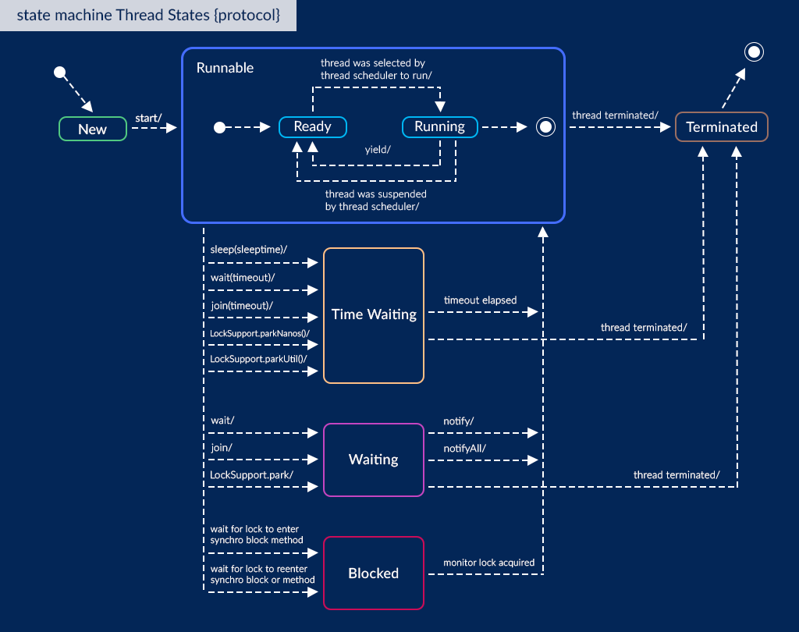

# [Java Thread](https://docs.oracle.com/javase/8/docs/api/java/lang/Thread.html)

Each thread is associated with an instance of the class [`Thread`](https://docs.oracle.com/javase/8/docs/api/java/lang/Thread.html).

A `Thread` is a thread of execution in a program. The JVM allows an application to have multiple threads of execution running concurrently. Every thread has a priority. Threads with higher priority are executed in preference to threads with lower priority.

```kotlin
fun main(){
	val mainThreadName = Thread.currentThread().name
	println("Main thread is $mainThreadName")
	val thread = Thread {
		val threadName = Thread.currentThread().name
		println("Hello from $threadName!")
	}
//  thread.run() // will not create a new Thread, but execute run() of passed Runnable
	thread.start()
}
```

A Thread can also be started with Kotlin's [`fun thread(){ }`](https://kotlinlang.org/api/latest/jvm/stdlib/kotlin.concurrent/thread.html)

```kotlin
fun main(){
	val mainThreadName = Thread.currentThread().name
	println("Main thread is $mainThreadName")
	val thread = thread {
		val threadName = Thread.currentThread().name
		println("Hello from $threadName!")
	} // starting created Thread
}
```

## Thread properties

- `static Thread.currentThread(): Thread` - Returns a reference to the currently executing thread object.
- `.name: String` - the thread's name.
- `.id: Long` - the thread's identifier.
- `.priority: Int` - the thread's priority.
- `.state: Thread.State` - the thread's state.
- `.isAlive(): Boolean` - Tests if this thread is alive.

## Lifecycle

- https://www.baeldung.com/java-thread-lifecycle
- https://javarush.com/quests/lectures/questmultithreading.level05.lecture03



```kotlin
enum class State {
	NEW,
	RUNNABLE,
	BLOCKED,
	WAITING,
	TIMED_WAITING,
	TERMINATED
}
Thread.currentThread().state: Thread.State
```

1. **NEW** - a newly created thread that has not yet started the execution
```kotlin
val thread = Thread{}
println(thread.state) // NEW
```

2. **RUNNABLE** - either running or ready for execution but it’s waiting for resource allocation
```kotlin
val thread = thread{}
println(thread.state) // RUNNABLE
```

3. **BLOCKED** - waiting to acquire a monitor lock to enter or re-enter a synchronized block/method
```kotlin
val lock = Any()
thread { synchronized(lock){ Thread.sleep(10) } }
val thread = thread{ synchronized(lock){} }
Thread.sleep(1) // just to make thread pass RUNNABLE state
println(thread.state) // BLOCKED
```

4. **WAITING** - waiting for some other thread to perform a particular action without any time limit
```kotlin
val threadA = thread { Thread.sleep(10) }  
val threadB = thread{ threadA.join() }  
Thread.sleep(1) // just to make thread pass RUNNABLE state
println(threadB.state) // WAITING
```

5. **TIMED_WAITING** - waiting for some other thread to perform a specific action for a specified period
```kotlin
val thread = thread{Thread.sleep(10)}  
Thread.sleep(1) // just to make thread pass RUNNABLE state  
println(thread.state) // TIMED_WAITING
```

6. **TERMINATED** - has completed its execution
```kotlin
val thread = thread{}  
thread.join()  
println(thread.state) // TERMINATED
```


## Thread control methods

### Sleep

- https://docs.oracle.com/javase/tutorial/essential/concurrency/sleep.html
- https://docs.oracle.com/javase/7/docs/api/java/lang/Thread.html

`Thread.sleep()` causes the current thread to suspend execution for a specified period.

```kotlin
println("1. Main thread started") // 1  
thread {  
    println("2. Thread started") // 3  
    Thread.sleep(200)  
    println("3. Thread finished") // 4  
}  
println("4. Main thread continues") // 2  
Thread.sleep(100)  
println("5. Main thread finished") // 5
```
```output
1. Main thread started
4. Main thread continues
2. Thread started
5. Main thread finished
3. Thread finished
```

### Join

- https://www.baeldung.com/java-thread-join
- https://docs.oracle.com/en/java/javase/21/docs/api/java.base/java/lang/Thread.html#join()

Waits for this thread to terminate.
Throws: `[InterruptedException]` - if any thread has interrupted the current thread. The *interrupted status* of the current thread is cleared when this exception is thrown.

When we invoke the `join()` method on a thread, the *calling thread* goes into a waiting state. It remains in a waiting state until the *referenced thread* terminates.

`join()` creates a ***happens-before** relationship*.

```kotlin
println("1. Main thread started") // 1
val thread = thread {
	println("2. Thread started") // 3
	Thread.sleep(300)
	println("3. Thread finished") // 6
}
println("4. Joining thread with timeout") // 2
thread.join(100) // calling thread: main; referenced thread: thread
println("5. Joining timeout exceeded") // 4
Thread.sleep(100)
println("6. Joining thread without timeout") // 5
thread.join() // calling thread: main; referenced thread: thread
println("7. Main thread finished") // 7
```
```output
1. Main thread started
4. Joining thread with timeout
2. Thread started
5. Joining timeout exceeded
6. Joining thread without timeout
3. Thread finished
7. Main thread finished
```


### Wait & Notify

- https://www.baeldung.com/java-wait-notify
- https://www.baeldung.com/cs/monitor
- https://docs.oracle.com/en/java/javase/21/docs/api/java.base/java/lang/Object.html#notify()
- https://javarush.com/groups/posts/4145-kofe-breyk-237-poljhzovateljhskaja-sinkhronizacija-v-java-s-ispoljhzovaniem-vstroennihkh-blokir
- https://jenkov.com/tutorials/java-concurrency/thread-signaling.html

- `wait()` - Causes the current thread to wait until it is awakened, typically by being _notified_ or _interrupted_.
- `wait(timeout)` - The same as `wait()`, but waiting until a certain amount of real time has elapsed.
- `notify()` - Wakes up a single thread that is waiting on this object's monitor. If any threads are waiting on this object, one of them is chosen to be awakened (depends on JVM implementation).
- `notifyAll()` - Wakes up all threads that are waiting on this object's monitor.

These methods should only be called by a thread that is the owner of this object's *monitor*. **`wait()` orders the calling thread to release the monitor and go to sleep until some other thread enters this monitor and calls `notify()`**.  Also, `notify()` wakes up **the first thread** that called `wait()` on the specific object.

https://ru.stackoverflow.com/questions/853006/kotlin-wait-and-notify
> In Kotlin, the `Any` class does not have `wait()`, `notify()`, `notifyAll()`. This is like a hint of what needs to be done differently.

https://stackoverflow.com/questions/35520583/why-are-there-no-concurrency-keywords-in-kotlin
> You can use wait and notify on Java Objects

https://kotlinlang.org/docs/java-interop.html#wait-notify
> Methods `wait()` and `notify()` are not available on references of type `Any`. Their usage is generally discouraged in favor of `java.util.concurrent`. If you really need to call these methods, you can cast to `java.lang.Object`:
```kotlin
(foo as java.lang.Object).wait()
```


```kotlin
val monitor = Any()  
thread {  
    println("A: Started")  
    Thread.sleep(25)  
    println("A: Finishing work")  
    synchronized(monitor){  
        println("A: Notifying")  
        (monitor as java.lang.Object).notify()  
        println("A: Notification sent, but we need to release monitor")  
        Thread.sleep(10)  
        println("A: Releasing monitor")  
    }
    Thread.sleep(10)
    println("A: Finished")  
}  
thread{  
    println("B: Started")  
    synchronized(monitor){  
        println("B: Waiting")  
        (monitor as java.lang.Object).wait() // Other Threads can enter synchronized(monitor){} because current Thread is waiting  
        println("B: Notification received")  
        Thread.sleep(10)  
        println("B: Releasing monitor")  
    }
    Thread.sleep(10)
    println("B: Finished")  
}
```
```output
A: Started
B: Started
B: Waiting
A: Finishing work
A: Notifying
A: Notification sent, but we need to release monitor
A: Releasing monitor
B: Notification received
B: Releasing monitor
A: Finished
B: Finished
```

#### Missed Signals Problem

The methods `notify()` and `notifyAll()` do not save the method calls to them in case no threads are waiting when they are called. The notify signal is then just lost. Therefore, if a thread calls notify() before the thread to signal has called wait(), the signal will be missed by the waiting thread. This may result in the waiting thread waiting forever.

To avoid losing signals they should be stored inside the signal class.

```kotlin
val monitor = Any()  
var signalled = false
thread {  
    println("A: Started")  
    Thread.sleep(25)  
    println("A: Finishing work")  
    synchronized(monitor){  
        println("A: Notifying")
        signalled = true
        (monitor as java.lang.Object).notify()  
        println("A: Notification sent, but we need to release monitor")  
        Thread.sleep(10)  
        println("A: Releasing monitor")  
    }
    Thread.sleep(10)
    println("A: Finished")  
}  
thread{  
    println("B: Started")  
    Thread.sleep(50)
    synchronized(monitor){  
        println("B: Waiting")
        if(!signalled) (monitor as java.lang.Object).wait()
        println("B: Notification received")  
        Thread.sleep(10)  
        println("B: Releasing monitor")  
    }
    Thread.sleep(10)
    println("B: Finished")  
}
```
```output
A: Started
B: Started
A: Finishing work
A: Notifying
A: Notification sent, but we need to release monitor
A: Releasing monitor
B: Waiting
B: Notification received
A: Finished
B: Releasing monitor
B: Finished
```

#### Spurious Wakeups Problem

For inexplicable reasons it is possible for threads to wake up even if `notify()` and `notifyAll()` has not been called. This is known as spurious wakeups. Wakeups without any reason.

To guard against spurious wakeups the signal member variable is checked inside a while loop instead of inside an if-statement. Such a while loop is also called a spin lock.

```kotlin
val monitor = Any()  
var signalled = false
thread {  
    println("A: Started")  
    Thread.sleep(25)  
    println("A: Finishing work")  
    synchronized(monitor){  
        println("A: Notifying")
        signalled = true
        (monitor as java.lang.Object).notify()  
        println("A: Notification sent, but we need to release monitor")  
        Thread.sleep(10)  
        println("A: Releasing monitor")  
    }
    Thread.sleep(10)
    println("A: Finished")  
}  
thread{  
    println("B: Started")
    synchronized(monitor){  
        println("B: Waiting")
        while(!signalled) (monitor as java.lang.Object).wait()
        println("B: Notification received")  
        Thread.sleep(10)  
        println("B: Releasing monitor")  
    }
    Thread.sleep(10)
    println("B: Finished")  
}
```
```output
A: Started
B: Started
B: Waiting
A: Finishing work
A: Notifying
A: Notification sent, but we need to release monitor
A: Releasing monitor
B: Notification received
B: Releasing monitor
A: Finished
B: Finished
```


#### Multiple Threads Waiting for the Same Signals

The while loop is also a nice solution if you have multiple threads waiting, which are all awakened using `notifyAll()`, but only one of them should be allowed to continue. Only one thread at a time will be able to obtain the lock on the monitor object, meaning only one thread can exit the `wait()` call and clear the `signalled` flag. Once this thread then exits the synchronized block, the other threads can exit the `wait()` call and check the `signalled` variable inside the while loop. However, this flag was cleared by the first thread waking up, so the rest of the awakened threads go back to waiting, until the next signal arrives.


#### Don't call `wait()` on constant `String`'s or global objects

The problem with calling wait() and notify() on the empty string `val monitor = ""`, or any other constant string is, that the JVM/Compiler internally translates constant strings into the same object. That means, that even if you have two different monitors, they both reference the same empty string instance.


#### BlockingQueue with wait & notify

- https://jenkov.com/tutorials/java-concurrency/blocking-queues.html
- https://stackoverflow.com/questions/2536692/a-simple-scenario-using-wait-and-notify-in-java

A blocking queue is a queue that blocks when you try to dequeue from it and the queue is empty, or if you try to enqueue items to it and the queue is already full. A thread trying to dequeue from an empty queue is blocked until some other thread inserts an item into the queue. A thread trying to enqueue an item in a full queue is blocked until some other thread makes space in the queue, either by dequeuing one or more items or clearing the queue completely.


```kotlin
class BlockingQueue<T>(val capacity: Int) {  
    private val queue: Queue<T> = LinkedList()  
    fun offer(element: T) = synchronized(this) {  
        // waiting until free space in queue  
        while (queue.size >= capacity) (this as Object).wait() // monitor is this  
        queue.offer(element)  
        (this as Object).notifyAll()  
    }  
    fun poll(): T  = synchronized(this) {  
        // waiting until any element in queue  
        while (queue.isEmpty()) (this as Object).wait()  
        val item = queue.poll()  
        (this as Object).notifyAll()  
        return item  
    }  
}
```


### Interruption

- https://docs.oracle.com/javase/tutorial/essential/concurrency/interrupt.html
- https://docs.oracle.com/javase/8/docs/api/java/lang/Thread.html#interrupt--

`interrupt()` - Interrupts this thread.

- If this thread is blocked in an invocation of the `wait()`, `join()` or `sleep()`, then its interrupt status will be cleared and it will receive an [`InterruptedException`](https://docs.oracle.com/javase/8/docs/api/java/lang/InterruptedException.html "class in java.lang").
- If this thread is blocked in an I/O operation upon an [`InterruptibleChannel`](https://docs.oracle.com/javase/8/docs/api/java/nio/channels/InterruptibleChannel.html "interface in java.nio.channels") then the channel will be closed, the thread's interrupt status will be set, and the thread will receive a [`ClosedByInterruptException`](https://docs.oracle.com/javase/8/docs/api/java/nio/channels/ClosedByInterruptException.html "class in java.nio.channels").
- If this thread is blocked in a [`Selector`](https://docs.oracle.com/javase/8/docs/api/java/nio/channels/Selector.html "class in java.nio.channels") then the thread's interrupt status will be set and it will return immediately
- **If none of the previous conditions hold then this thread's interrupt status will be set.**
- Interrupting a thread that is not alive need not have any effect.

`.isInterrupted` - Tests whether this thread has been interrupted. The _interrupted status_ of the thread is unaffected by this method.

`.interrupted()` - Tests whether the current thread has been interrupted. The _interrupted status_ of the thread is cleared by this method.

**Interruption is cooperative!** If no Exception case is occured, we need to check interrupt status during Thread execution if we expecting one.

```kotlin
val thread = thread {  
    println("Thread started")  
    Thread.sleep(1)  
    repeat(100) { i ->  
        println("$i: isInterrupted: ${Thread.currentThread().isInterrupted}")
        // println("$i: interrupted(): ${Thread.interrupted()}")
    }  
    println("Thread finished by itself")  
}  
Thread.sleep(9)  
println("trying to interrupt")  
thread.interrupt()  
println("interrupt executed")
```

Output is not stable, because interruption during `Thread.sleep(1)` causes `InterruptedException`. One of successfull experiments:

```output
Thread started
0: isInterrupted: false
1: isInterrupted: false
2: isInterrupted: false
...
43: isInterrupted: false
44: isInterrupted: false
trying to interrupt
45: isInterrupted: false
interrupt executed
46: isInterrupted: true
47: isInterrupted: true
...
98: isInterrupted: true
99: isInterrupted: true
Thread finished by itself
```

In case of `Thread.interrupted()`:

```output
Thread started
0: interrupted(): false
1: interrupted(): false
...
63: interrupted(): false
64: interrupted(): false
trying to interrupt
65: interrupted(): false
interrupt executed
66: interrupted(): true
67: interrupted(): false
...
98: interrupted(): false
99: interrupted(): false
Thread finished by itself
```

Cooperative interruption:

```kotlin
val thread = thread {  
    println("Thread started")  
    Thread.sleep(1)  
    repeat(100) { i ->  
        val isInterrupted = Thread.currentThread().isInterrupted  
        println("$i: isInterrupted: $isInterrupted")  
        if(isInterrupted){  
            println("Cooperative interruption")  
            return@thread  
        }  
    }  
    println("Thread finished by itself")  
}  
Thread.sleep(9)  
println("trying to interrupt")  
thread.interrupt()  
println("interrupt executed")
```
```output
Thread started
0: isInterrupted: false
1: isInterrupted: false
...
18: isInterrupted: false
19: isInterrupted: false
trying to interrupt
interrupt executed
20: isInterrupted: false
21: isInterrupted: true
Cooperative interruption
```

Interruption during `Thread.sleep()` by `InterruptedException`

```kotlin
val thread = thread {  
    println("Thread started")  
    try {  
        Thread.sleep(100)  
    } catch (e: InterruptedException){  
        println("Thread interrupted")  
        return@thread  
    }  
    println("Thread finished by itself")  
}  
Thread.sleep(10)  
println("trying to interrupt")  
thread.interrupt()  
println("interrupt executed")
```
```output
Thread started
trying to interrupt
interrupt executed
Thread interrupted
```

Interruption during `join()` by `InterruptedException`

```kotlin
val threadA = thread {  
    Thread.sleep(100)  
}  
val threadB = thread {  
    println("Thread started")  
    try {  
        threadA.join()  
    } catch (e: InterruptedException){  
        println("Thread interrupted")  
        return@thread  
    }  
    println("Thread finished by itself")  
}  
Thread.sleep(10)  
println("trying to interrupt")  
threadB.interrupt()  
println("interrupt executed")
```
```output
Thread started
trying to interrupt
interrupt executed
Thread interrupted
```


## Most common multithread errors

- https://jenkov.com/tutorials/java-concurrency/thread-safety.html

Threads communicate primarily by sharing access to fields and the objects reference fields refer to. This form of communication is extremely efficient, but makes two kinds of errors possible: **thread interference** and **memory consistency errors**.
### [Thread Interference](https://docs.oracle.com/javase/tutorial/essential/concurrency/interfere.html)

Interference happens when two operations, running in different threads, but acting on the same data, _interleave_.

One of the most common **Example 1** is:

```kotlin
class Counter {
    var c = 0
	    private set
    fun increment() = c++
    fun decrement() = c--
}
fun main() {
	val counter = Counter()
	val threadA = thread { counter.increment() }
	val threadB = thread { counter.decrement() }
	println(counter.c) // -1
}
```

`c++`/`c--` can be decomposed into three steps:

1. Retrieve the current value of `c`.
2. Increment/Decrement the retrieved value by `1`.
3. Store the result value back in `c`.

So the result actions consequence might be:

1. `threadA`: Retrieve `c`.
2. `threadB`: Retrieve `c`.
3. `threadA`: Increment retrieved value; result is `1`.
4. `threadB`: Decrement retrieved value; result is `-1`.
5. `threadA`: Store result in `c`; `c` is now `1`.
6. `threadB`: Store result in `c`; `c` is now `-1`.

Let's consider **Example 2**:

```kotlin
var a = 0  
var b = 0  
val thread1 = thread {  
    a = 1  
    println("b = $b")  
}  
val thread2 = thread {  
    b = 1  
    println("a = $a")  
}
```

According to Java Memory Model all actions in both threads are independent and have no *happends-before* constraints. So there can be several possible outputs depending on different actions order:

- **Case 1**: both treads are executed consequtively
```kotlin
// a = 0, b = 0
/*thread1*/ a = 1 // a = 1, b = 0 
/*thread1*/ println("b = $b") // b = 0
/*thread2*/ b = 1 // a = 1, b = 1
/*thread2*/ println("a = $a") // a = 1
```

- **Case 2**: the same, but `thread2` executed before `thread1`:
```kotlin
// a = 0, b = 0
/*thread2*/ b = 1 // a = 0, b = 1
/*thread2*/ println("a = $a") // a = 0
/*thread1*/ a = 1 // a = 1, b = 1 
/*thread1*/ println("b = $b") // b = 1
```

- **Case 3**: Actions of thread1 and thread2 are executed asynchronously and merged:
```kotlin
// a = 0, b = 0
/*thread1*/ a = 1 // a = 1, b = 0 
/*thread2*/ b = 1 // a = 1, b = 1
/*thread1*/ println("b = $b") // b = 1
/*thread2*/ println("a = $a") // a = 1
```

- **Case 4**: The same, but `thread2` executed 'inside' actions of `thread1`:
```kotlin
// a = 0, b = 0
/*thread1*/ a = 1 // a = 1, b = 0 
/*thread2*/ b = 1 // a = 1, b = 1
/*thread2*/ println("a = $a") // a = 1
/*thread1*/ println("b = $b") // b = 1
```

### Reordering issues

The same **Example 2**:

```kotlin
var a = 0  
var b = 0  
val thread1 = thread {  
    a = 1  
    println("b = $b")  
}  
val thread2 = thread {  
    b = 1  
    println("a = $a")  
}
```

Since actions in both threads are independent and have no *happends-before* constraints, they could be *reordered* for the sake of optimization. It wont affect the outut in **Case 1** or **Case 2**, but gives another result for *Case 3* and **Case 4**:

- **Case 5**: Actions (assign and println) of `thread2` are reordered. Threads' actions are executed asynchronously.
```kotlin
// a = 0, b = 0
/*thread1*/ a = 1 // a = 1, b = 0
/*thread2*/ println("a = $a") // a = 1
/*thread1*/ println("b = $b") // b = 0
/*thread2*/ b = 1 // a = 1, b = 1
```

- **Case 6**: Actions (assign and println) of `thread1` are reordered. Threads' actions are executed asynchronously.
```kotlin
// a = 0, b = 0
/*thread2*/ b = 1 // a = 1, b = 1
/*thread1*/ println("b = $b") // b = 1
/*thread2*/ println("a = $a") // a = 0
/*thread1*/ a = 1 // a = 1, b = 0
```

- **Case 7**: Both actions (assign and println) in both threads are reordered. Threads' actions are executed asynchronously.
```kotlin
// a = 0, b = 0
/*thread1*/ println("b = $b") // b = 0
/*thread2*/ println("a = $a") // a = 0
// or the same:
/*thread2*/ println("a = $a") // a = 0
/*thread1*/ println("b = $b") // b = 0

/*thread1*/ a = 1 // a = 1, b = 0 
/*thread2*/ b = 1 // a = 1, b = 1
// or the same if last 2 actions:
/*thread2*/ b = 1 // a = 0, b = 1
/*thread1*/ a = 1 // a = 1, b = 1 
```

### Memory Consistency Errors

- https://docs.oracle.com/javase/tutorial/essential/concurrency/memconsist.html
- https://jenkov.com/tutorials/java-concurrency/java-memory-model.html
- https://jenkov.com/tutorials/java-concurrency/false-sharing.html

The same **Example 2**:

```kotlin
var a = 0  
var b = 0  
val thread1 = thread {  
    a = 1  
    println("b = $b")  
}  
val thread2 = thread {  
    b = 1  
    println("a = $a")  
}
```

Memory Consistency Errors occur when different threads have inconsistent views of what should be the same data.

There may be other cases, because memory between 2 threads is not syncronized. So writing variable in one thread may not affect reading this variable in the other.

If variable have no *happends-before* constraints, like `synchronized(){}`, JVM may create local copies of variables for both threads, and use them during these `Thread`s execution. This may happen if both threads are executed on different CPUs. Then each CPU have local copy of variables in registers. ([This](https://jenkov.com/tutorials/java-concurrency/cache-coherence-in-java-concurrency.html) article describes what is really happening)
Variables in their common memory space (in RAM, or in their original CPU's local memory space) are syncronized with their copies after `Thread` finish. Such mechanism allows to optimize memory usage for both `Thread`s and reduse expensive RAM fetches.

Considering **Case 3**:
**Case 8**: Both threads are executed on different CPUs, which have local copies of variables in registers.
```kotlin
// RAM: a = 0, b = 0
/*thread1*/ // a = 0, b = 0
/*thread2*/ // a = 0, b = 0
/*thread1*/ a = 1 // a = 1, b = 0 
/*thread2*/ b = 1 // a = 0, b = 1
/*thread1*/ println("b = $b") // b = 0
/*thread2*/ println("a = $a") // a = 0
// RAM: a = 1, b = 1
```


## Syncronization

- https://docs.oracle.com/javase/tutorial/essential/concurrency/sync.html
- https://jenkov.com/tutorials/java-concurrency/synchronized.html
- https://jenkov.com/tutorials/java-concurrency/java-happens-before-guarantee.html

Java provides two basic synchronization idioms: **<u>synchronized methods</u>** and **<u>synchronized statements</u>**.

Synchronization is built around an internal entity known as the **<u>intrinsic lock</u>** or **<u>monitor lock</u>**. Monitor locks:
- grant exclusive access to an object's state
- establish *happens-before* relationships

- Every object has an monitor lock associated with it.
- A thread that needs exclusive and consistent access to an object's fields has to ***acquire*** the object's monitor lock before accessing them, and then ***release*** the monitor lock when it's done with them.
- A thread ***own*** the monitor lock between the time it has acquired the lock and released the lock. **As long as a thread owns a monitor lock, no other thread can acquire the same lock.**
- The other thread will block when it attempts to acquire the lock.
- When a thread releases a monitor lock, a happens-before relationship is established between that action and any subsequent acquisition of the same lock.

Thus,
A thread becomes the owner of the object's *monitor lock* in one of three ways:

- By executing a synchronized instance method of that object.
- By executing the body of a `synchronized` statement that synchronizes on the object.

**Only one thread at a time can own an object's monitor**.

```kotlin

```

**Java Synchronized Entry Visibility Guarantee**:
> When a thread enters a `synchronized` block, all variables visible to the thread are refreshed from main memory.

**Java Synchronized Exit Visibility Guarantee**:
> When a thread exits a `synchronized` block, all variables visible to the thread are written back to main memory.

https://jenkov.com/tutorials/java-concurrency/cache-coherence-in-java-concurrency.html

https://jenkov.com/tutorials/java-concurrency/false-sharing.html


### Deadlock

- https://jenkov.com/tutorials/java-concurrency/deadlock.html
- https://jenkov.com/tutorials/java-concurrency/deadlock-prevention.html
- 

```kotlin
fun deadlock() {  
    val leftFork = Any()  
    val rightFork = Any()  
    val mathematicianA = thread {  
        println("A: taking leftFork")  
        synchronized(leftFork){  
            println("A: leftFork taken")  
            Thread.sleep(10)  
            println("A: taking rightFork")  
            synchronized(rightFork){ // DEADLOCK!  
                // Eating spaghetti
            } // free second fork  
        } // free first fork  
    }  
    val mathematicianB = thread {
        println("B: taking rightFork")
        synchronized(rightFork){
            println("B: rightFork taken")
            Thread.sleep(10)
            println("B: taking leftFork")
            synchronized(leftFork){ // DEADLOCK!
                // Eating spaghetti
            } // free second fork
        } // free first fork
    }  
}
```
```output
A: taking leftFork
A: leftFork taken
B: taking rightFork
B: rightFork taken
A: taking rightFork
B: taking leftFork
```


