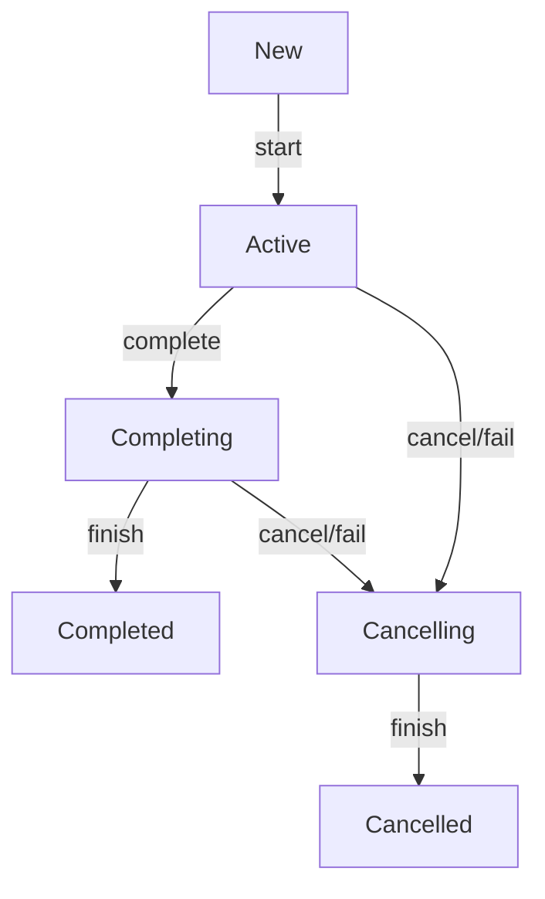

# Coroutines

- https://kotlinlang.org/docs/coroutines-guide.html
- https://github.com/Kotlin/KEEP/blob/master/proposals/coroutines.md

A **<u>coroutine</u>** is an instance of a suspendable computation. It is conceptually similar to a thread, in the sense that it takes a block of code to run that works concurrently with the rest of the code. However, a coroutine is not bound to any particular thread. It may suspend its execution in one thread and resume in another one.

In Java each thread is associated with an instance of the class `Thread`.
In Kotlin such class is [`AbstractCoroutine`](https://github.com/Kotlin/kotlinx.coroutines/blob/master/kotlinx-coroutines-core/common/src/AbstractCoroutine.kt) or [`ScopeCoroutine: AbstractCoroutine`](https://github.com/Kotlin/kotlinx.coroutines/blob/master/kotlinx-coroutines-core/common/src/internal/Scopes.kt)

`CoroutineScope` common [builders](https://github.com/Kotlin/kotlinx.coroutines/blob/master/kotlinx-coroutines-core/common/src/Builders.common.kt) create
- `DeferredCoroutine: AbstractCoroutine`
- `LazyDeferredCoroutine: DeferredCoroutine`
- `StandaloneCoroutine: AbstractCoroutine`
- `LazyStandaloneCoroutine: StandaloneCoroutine`
- `UndispatchedCoroutine: ScopeCoroutine`
- `DispatchedCoroutine: ScopeCoroutine`
And probably some other classes.

None of this classes are instantiated explicitly (like `Thread t = new Thread(...);`).

In practice we use:

- `CoroutineContext` to store, combine and access *coroutine* properties (incl. `Job`, `CoroutineDispatcher` and `CoroutineExceptionHandler`)
- `CoroutineScope` (that incapsulse `CoroutineContext`) to build coroutines and manage them by `CoroutineContext` elements.

This is only an illustration of using coroutines:

```kotlin
fun main() {  
    println("Main started")  
    runBlocking { // this: CoroutineScope  
        println("Main coroutine started")  
        launch { // launch a new coroutine and continue  
            println("Coroutine started")  
            delay(1000) // non-blocking delay for 1 second  
            println("Coroutine finished")  
        }  
        // main coroutine continues while a previous one is delayed  
        println("Main coroutine finished, but waits until its child finishes")  
    }  
    println("Main finished")  
}
```
```output
Main started
Main coroutine started
Main coroutine finished, but waits until its child finishes
Coroutine started
Coroutine finished
Main finished
```

## [suspend functions](https://kotlinlang.org/docs/composing-suspending-functions.html)

`suspend fun` can *suspend* execution of a coroutine. Suspending functions can be used only inside coroutines or other `suspend fun`.

The `suspend` modifier does nothing by itself. The `suspend` modifier indicates that this is a function that can suspend execution of a coroutine. A modifier `suspend` may be used on any function: top-level function, extension function, member function, local function, or operator function.

Suspending functions may invoke any regular functions, but to actually suspend execution they must invoke some other suspending function.

```kotlin
suspend fun doSmth(): Int {
    delay(1000) // executing suspend fun delay
    return 42
}
fun main() = runBlocking {
	val result = doSmth()
    println(result)
}
```

Suspending functions are **sequential by default**.

```kotlin
suspend fun doSomethingUsefulOne(): Int {
    delay(1000) // pretend we are doing something useful here
    return 13
}
suspend fun doSomethingUsefulTwo(): Int {
    delay(1000) // pretend we are doing something useful here, too
    return 29
}

fun main() = runBlocking {
    val time = measureTimeMillis {
        val one = doSomethingUsefulOne()
        val two = doSomethingUsefulTwo()
        println("The answer is ${one + two}")
    }
    println("Completed in $time ms")
}
```
```output
The answer is 42
Completed in 2021 ms
```

When `suspendCoroutine` is called inside a coroutine (and it can _only_ be called inside a coroutine, because it is a suspending function) it captures the execution state of a coroutine in a _continuation_ instance and passes this continuation to the specified `block` as an argument. To resume execution of the coroutine, the block invokes `continuation.resumeWith()` (either directly or using `continuation.resume()` or `continuation.resumeWithException()` extensions) in this thread or in some other thread at some later time. The _actual_ suspension of a coroutine happens when the `suspendCoroutine` block returns without invoking `resumeWith`. If continuation was resumed before returning from inside of the block, then the coroutine is not considered to have been suspended and continues to execute. The result passed to `continuation.resumeWith()` becomes the result of `suspendCoroutine` call, which, in turn, becomes the result of `.await()`.

[`coroutineContext`](https://kotlinlang.org/api/core/kotlin-stdlib/kotlin.coroutines/coroutine-context.html) is a top-level property that is available in all suspending functions to retrieve the `CoroutineContext` of the current coroutine.

[currentCoroutineContext](https://kotlinlang.org/api/kotlinx.coroutines/kotlinx-coroutines-core/kotlinx.coroutines/current-coroutine-context.html) returns the current `CoroutineContext` retrieved by using `coroutineContext`. This function is an alias to avoid name clash with `CoroutineScope.coroutineContext` in a receiver position.
## CoroutineContext

- https://kotlinlang.org/docs/coroutine-context-and-dispatchers.html
- https://kotlinlang.org/api/core/kotlin-stdlib/kotlin.coroutines/-coroutine-context/
- https://github.com/Kotlin/KEEP/blob/master/proposals/coroutines.md#coroutine-context
- https://github.com/JetBrains/kotlin/blob/master/libraries/stdlib/src/kotlin/coroutines/CoroutineContext.kt

`CoroutineСontext` is a persistent set of user-defined objects that can be attached to the coroutine. Each coroutine always executes in the context represented by elements of `CoroutineСontext`, which are responsible for various aspects of coroutine execution.

`CoroutineСontext` is an indexed set of elements, where each element has a unique key. It is a mix between a set and a map.

```kotlin
public interface CoroutineContext {
    public operator fun <E : Element> get(key: Key<E>): E?
	...
	// Key for the elements of [CoroutineContext].
    public interface Key<E : Element>
    // An element of the [CoroutineContext]. An element of the coroutine context is a singleton context by itself.
    public interface Element : CoroutineContext {
        public val key: Key<*>
        public override operator fun <E : Element> get(key: Key<E>): E? =
            @Suppress("UNCHECKED_CAST")
            if (this.key == key) this as E else null
        ...
    }
}
```

During this section we only consider the following objects like elements of `CoroutineСontext`. Their detailed explanation is described further.

### `CoroutineСontext` elements:

#### `Job`

`Job` allows to manage coroutine lifecycle and its children.

```kotlin
public interface Job : CoroutineContext.Element {
    // Key for [Job] instance in the coroutine context.
    public companion object Key : CoroutineContext.Key<Job>
```

#### `CoroutineDispatcher`

allows to manage *coroutine* threads policy

```kotlin
public abstract class CoroutineDispatcher :
    AbstractCoroutineContextElement(ContinuationInterceptor), ... {
    public companion object Key : AbstractCoroutineContextKey<ContinuationInterceptor, CoroutineDispatcher>(
        ContinuationInterceptor,
        { it as? CoroutineDispatcher })
```

#### `CoroutineExceptionHandler`

allows to handle *coroutine* exceptions.

```kotlin
public interface CoroutineExceptionHandler : CoroutineContext.Element {
    // Key for [CoroutineExceptionHandler] instance in the coroutine context.
    public companion object Key : CoroutineContext.Key<CoroutineExceptionHandler>
```

#### `CoroutineName`

allows to add a `String` name to a coroutine.

```kotlin
public data class CoroutineName(...) : AbstractCoroutineContextElement(CoroutineName) {
	// Key for [CoroutineName] instance in the coroutine context.
    public companion object Key : CoroutineContext.Key<CoroutineName>
```


#### Custom `CoroutineContext.Element`

All third-party context elements shall extend [`AbstractCoroutineContextElement`](https://kotlinlang.org/api/core/kotlin-stdlib/kotlin.coroutines/-abstract-coroutine-context-element/) class. The following style is recommended for library defined context elements. The example below shows a hypothetical authorization context element that stores current user name:

```kotlin
class AuthUser(val name: String) : AbstractCoroutineContextElement(AuthUser) {
    companion object Key : CoroutineContext.Key<AuthUser>
}
suspend fun doSomething() {
    val currentUser = coroutineContext[AuthUser]?.name ?: throw SecurityException("unauthorized")
    // do something user-specific
}
```

### `CoroutineСontext` composition

Thus, each element [`CoroutineСontext.Element`](https://kotlinlang.org/api/core/kotlin-stdlib/kotlin.coroutines/-coroutine-context/-element/) of the `CoroutineСontext` **IS** `CoroutineСontext` itself (as it implements ` : CoroutineContext.Element : CoroutineContext`). An element of the coroutine context is a singleton context by itself.

```kotlin
val job: CoroutineContext = Job() // this is not constructor, as Job is an interface
```

`companion object Key` allows to `get` elements of `CoroutineСontext` by class (as `companion object` resolved statically):

```kotlin
// we can get an element of CoroutineContext with its
// operator fun <E : CoroutineContext.Element> get(key: CoroutineContext.Key<E>): E?
val job = coroutineContext[Job.Key] // Job.Key : CoroutineContext.Key<Job>
// or just
val job = coroutineContext[Job] // here Job is treated as its companion object Key
```

e.g., creating a new `Job`, we are also creating `CoroutineContext` that contains that `Job` as its element:

```kotlin
val job = Job()
assert(job == job[Job]) // true
```

Job can always be retrieved from `CoroutineContext` with `.job`:

```kotlin
coroutineContext[Job] == coroutineContext.job
```

`CoroutineСontext` also provides `fold`, `plus` and `minusKey` functions, which allows to compose `CoroutineСontext`s.

```kotlin
    // Accumulates entries of this context starting with [initial] value and applying [operation] from left to right to current accumulator value and each element of this context.
    public fun <R> fold(initial: R, operation: (R, Element) -> R): R

	// Returns a context containing elements from this context and elements from the other [context]. The elements from this context with the same key as in the other one are dropped.
    public operator fun plus(context: CoroutineContext): CoroutineContext {...}

	// Returns a context containing elements from this context, but without an element with the specified [key].
    public fun minusKey(key: Key<*>): CoroutineContext

	public interface Element : CoroutineContext {
		...
        public override fun <R> fold(initial: R, operation: (R, Element) -> R): R =
            operation(initial, this)
        public override fun minusKey(key: Key<*>): CoroutineContext =
            if (this.key == key) EmptyCoroutineContext else this
```

`operator fun plus` union `CoroutineСontext` sets with priority to the elements of the right operand:

```
CoroutineContext_A { Job_A, CoroutineDispatcher_A }
+
CoroutineContext_B { Job_B, CoroutineExceptionHandler_B }
=
CoroutineContext_C { Job_B, CoroutineDispatcher_A, CoroutineExceptionHandler_B }
```

Thus we can construct `CoroutineСontext` using its elements (as each element of the `CoroutineСontext` is `CoroutineСontext`):

```kotlin
val coroutineContext = Job() + Dispatchers.Default + CoroutineExceptionHandler{_,_->}  
coroutineContext.fold(""){ str, elem -> "".also { println(elem) } }
```
```output
JobImpl{Active}@5e265ba4
ThreadsKt$main$$inlined$CoroutineExceptionHandler$1@156643d4
Dispatchers.Default
```

```kotlin
fun CoroutineContext.print() = println(fold(""){ str, elem -> "$str$elem; " })  
val coroutineContextA = Job() + Dispatchers.Default  
val coroutineContextB = Job() + CoroutineExceptionHandler {_,_->}  
val coroutineContext = coroutineContextA + coroutineContextB  
coroutineContextA.print()  
println("+")  
coroutineContextB.print()  
println("=")  
coroutineContext.print()
```
```output
JobImpl{Active}@123772c4; Dispatchers.Default; 
+
JobImpl{Active}@2d363fb3; ThreadsKt$main$$inlined$CoroutineExceptionHandler$1@7d6f77cc; 
=
JobImpl{Active}@2d363fb3; ThreadsKt$main$$inlined$CoroutineExceptionHandler$1@7d6f77cc; Dispatchers.Default; 
```

Standard library provides [`EmptyCoroutineContext`](https://kotlinlang.org/api/core/kotlin-stdlib/kotlin.coroutines/-empty-coroutine-context/) — an instance of `CoroutineContext` without any elements (empty).

## Job

- https://kotlinlang.org/api/kotlinx.coroutines/kotlinx-coroutines-core/kotlinx.coroutines/-job/
- https://github.com/Kotlin/kotlinx.coroutines/blob/master/kotlinx-coroutines-core/common/src/Job.kt

A background job. `Job` is an abstraction on *coroutine* lifecycle.

All functions on `Job` interface and on all interfaces derived from it are **thread-safe** and can be safely invoked from concurrent coroutines without external synchronization.

A `Job` can be created using [standard function](https://github.com/Kotlin/kotlinx.coroutines/blob/master/kotlinx-coroutines-core/common/src/Job.kt#L108):

```kotlin
public fun Job(parent: Job? = null): CompletableJob = JobImpl(parent)
```

But usually a `Job` is created with coroutine builders.

```kotlin
val job = Job() // this is not a Job constructor, as Job is an interface
val job = launch {...}
```

### Job States

A job has the following states:

- ***New*** (optional initial state) - coroutine is created with `start=CoroutineStart.LAZY`
- ***Active*** (default initial state)- coroutine is created with `start=CoroutineStart.DEFAULT` or started with `.start()` or `.join()`. A job is *active* while the coroutine is working or until it fails or cancelled.
- ***Completing*** (transient state) - Completion of an *active* coroutine's body transitions the job to the *completing* state.
- ***Cancelling*** (transient state) - Failure of an *active* job with an exception makes it *cancelling*. A job can be cancelled at any time with `cancel` function that forces it to transition to the *cancelling* state immediately.
- ***Cancelled*** (final state) - The *cancelling* job becomes *cancelled* when it finishes executing its work **and all its children complete**.
- ***Completed*** (final state) - The *completing* job becomes *completed* when it finishes executing its work **and all its children complete**. This state is purely internal to the job. For an outside observer a *completing* job is still *active*.

| **State**        | .isActive | .isCompleted | .isCancelled |
| ---------------- | --------- | ------------ | ------------ |
| ***New***        | `false`   | `false`      | `false`      |
| ***Active***     | `true`    | `false`      | `false`      |
| ***Completing*** | `true`    | `false`      | `false`      |
| ***Cancelling*** | `false`   | `false`      | `true`       |
| ***Cancelled***  | `false`   | `true`       | `true`       |
| ***Completed***  | `false`   | `true`       | `false`      |



### Job Hierarchy

Jobs can be arranged into parent-child hierarchies where cancellation of a parent leads to immediate cancellation of all its children recursively. Failure of a child with an exception other than `CancellationException` immediately cancels its parent and, consequently, all its other children.

- [`children: Sequence<Job>`](https://kotlinlang.org/api/kotlinx.coroutines/kotlinx-coroutines-core/kotlinx.coroutines/-job/children.html) Returns a sequence of this job's children.
- [`parent: Job?`](https://kotlinlang.org/api/kotlinx.coroutines/kotlinx-coroutines-core/kotlinx.coroutines/-job/parent.html) Returns the parent of the current job if the parent-child relationship is established or `null` if the job has no parent or was successfully completed.

A `Job C` becomes a child of `Job P` when it is constructed with this `Job P` in its `CoroutineContext`.

```kotlin
val parentJob = launch {
    println("inside of launch parentJob = ${coroutineContext.job}")
    val childJob1 = launch {
        delay(100)
        println("childJob1 = ${coroutineContext.job}")
        println("childJob1.parent = ${coroutineContext.job.parent}")
    }
    println("parentJob created childJob1: $childJob1")
    val childJob2 = launch {
        delay(200)
        println("childJob2 = ${coroutineContext.job}")
        println("childJob2.parent = ${coroutineContext.job.parent}")
    }
    println("parentJob created childJob2: $childJob2")
    println("parentJob.children:")
    coroutineContext.job.children.forEach { println(it) }
}
println("parentJob = $parentJob")
```
```output:
parentJob = StandaloneCoroutine{Active}@60215eee
inside of launch parentJob = StandaloneCoroutine{Active}@60215eee
parentJob created childJob1: StandaloneCoroutine{Active}@67117f44
parentJob created childJob2: StandaloneCoroutine{Active}@2471cca7
parentJob.children:
StandaloneCoroutine{Active}@67117f44
StandaloneCoroutine{Active}@2471cca7
childJob1 = StandaloneCoroutine{Active}@67117f44
childJob1.parent = StandaloneCoroutine{Completing}@60215eee
childJob2 = StandaloneCoroutine{Active}@2471cca7
childJob2.parent = StandaloneCoroutine{Completing}@60215eee
```

###### |CUT| How this works:

`launch` is the extension fun of `CoroutineScope`. It use  its parent's `CoroutineContext` to build  the new child's `CoroutineContext`, which uses parent's `CoroutineContext` elements, but the new child `Job`. This child `Job` is attached to the parent `Job` (which can be retrieved from parent's `CoroutineContext`) and returned from `launch { }`.

[`launch`](https://github.com/Kotlin/kotlinx.coroutines/blob/master/kotlinx-coroutines-core/common/src/Builders.common.kt) creates a context with:

```kotlin
public fun CoroutineScope.launch(
    context: CoroutineContext = EmptyCoroutineContext,
    start: CoroutineStart = CoroutineStart.DEFAULT,
    block: suspend CoroutineScope.() -> Unit
): Job {
    val newContext = newCoroutineContext(context)
	...
```

[`expect newCoroutineContext()`](https://github.com/Kotlin/kotlinx.coroutines/blob/master/kotlinx-coroutines-core/common/src/CoroutineContext.common.kt), [`actual newCoroutineContext()`](https://github.com/Kotlin/kotlinx.coroutines/blob/master/kotlinx-coroutines-core/jvm/src/CoroutineContext.kt):

```kotlin
public expect fun CoroutineScope.newCoroutineContext(context: CoroutineContext): CoroutineContext
public actual fun CoroutineScope.newCoroutineContext(context: CoroutineContext): CoroutineContext {  
    val combined = foldCopies(coroutineContext, context, true)
    // here coroutineContext is parent
    // context = EmptyCoroutineContext (if launch with default param)
    // fold essentially + contexts
```

Thus, `val newContext = coroutineContext` in `CoroutineScope.launch`.

`launch` returns [`StandaloneCoroutine`](https://github.com/Kotlin/kotlinx.coroutines/blob/master/kotlinx-coroutines-core/common/src/Builders.common.kt) which is [`AbstractCoroutine<Unit>(parentContext, initParentJob = true,...`](https://github.com/Kotlin/kotlinx.coroutines/blob/master/kotlinx-coroutines-core/common/src/AbstractCoroutine.kt), that has:

```kotlin
public abstract class AbstractCoroutine<in T>(
    parentContext: CoroutineContext,
    initParentJob: Boolean,
    active: Boolean
) : JobSupport(active), Job,... {
	init {
	    /*
	     * Setup parent-child relationship between the parent in the context
	     * and the current coroutine.
	     * It may cause this coroutine to become _cancelling_
	     * if the parent is already cancelled.
	     * It is dangerous to install parent-child relationship here if the coroutine class
	     * operates its state from within onCancelled or onCancelling
	     * (with exceptions for rx integrations that can't have any parent)
	     */
	    if (initParentJob) initParentJob(parentContext[Job])
	}
```

[`initParentJob`](https://github.com/Kotlin/kotlinx.coroutines/blob/master/kotlinx-coroutines-core/common/src/JobSupport.kt) is:

```kotlin
public open class JobSupport (active: Boolean) : Job, ChildJob, ParentJob {
...
    protected fun initParentJob(parent: Job?) {
        ...
        parent.start() // make sure the parent is started
        @Suppress("DEPRECATION")
        val handle = parent.attachChild(this) // this: JobSupport: ChildJob
```
###### |CUT| finish

A `Job` can be created using an explicit `parent` parameter:

```kotlin
val parentJob = launch {  
    delay(100)  
    println("inside of launch parentJob = ${coroutineContext.job}")  
    delay(250)  
    println("parentJob.children:")  
    coroutineContext.job.children.forEach { println("$it -> ${it.children.first()}") }  
}  
println("parentJob = $parentJob")  
  
val childJob1 = Job(parentJob)  
println("childJob1 = $childJob1")  
val childSubJob1 = launch(context = childJob1) { // launch always creates a new job  
    delay(200)  
    println("inside of launch childSubJob1 = ${coroutineContext.job}")  
    println("childSubJob1.parent = childJob1 = ${coroutineContext.job.parent}")  
    println("childSubJob1.parent?.parent = childJob1.parent = ${coroutineContext.job.parent?.parent}")  
    delay(200)  
}  
println("childSubJob1 = $childSubJob1")  
// CompletableJob will stay active even if its children are completed, so we need to complete it explicitly  
childJob1.complete() // parentJob will infinitely wait this Job otherwise  
  
val childJob2 = Job(parentJob)  
println("childJob2 = $childJob2")  
val childSubJob2 = launch(context = childJob2) { // launch always creates a new job  
    delay(300)  
    println("inside of launch childSubJob2 = ${coroutineContext.job}")  
    println("childSubJob2.parent = childJob2 = ${coroutineContext.job.parent}")  
    println("childSubJob2.parent?.parent = childJob2.parent = ${coroutineContext.job.parent?.parent}")  
    delay(100)  
}  
println("childSubJob2 = $childSubJob2")  
// CompletableJob will stay active even if its children are completed, so we need to complete it explicitly  
childJob2.complete() // parentJob will infinitely wait this Job otherwise
```
```output
parentJob = StandaloneCoroutine{Active}@60215eee
childJob1 = JobImpl{Active}@7d4793a8
childSubJob1 = StandaloneCoroutine{Active}@5479e3f
childJob2 = JobImpl{Active}@763d9750
childSubJob2 = StandaloneCoroutine{Active}@2be94b0f
inside of launch parentJob = StandaloneCoroutine{Active}@60215eee
inside of launch childSubJob1 = StandaloneCoroutine{Active}@5479e3f
childSubJob1.parent = childJob1 = JobImpl{Completing}@7d4793a8
childSubJob1.parent?.parent = childJob1.parent = StandaloneCoroutine{Active}@60215eee
inside of launch childSubJob2 = StandaloneCoroutine{Active}@2be94b0f
childSubJob2.parent = childJob2 = JobImpl{Completing}@763d9750
childSubJob2.parent?.parent = childJob2.parent = StandaloneCoroutine{Active}@60215eee
parentJob.children:
JobImpl{Completing}@7d4793a8 -> StandaloneCoroutine{Active}@5479e3f
JobImpl{Completing}@763d9750 -> StandaloneCoroutine{Active}@2be94b0f
```

###### |CUT| How this works:


###### |CUT| finish

A parent-child relation has the following effect:

- Cancellation of parent with `cancel()` or its exceptional completion (failure) immediately cancels all its children.
- Parent cannot complete until all its children are complete. Parent waits for all its children to complete in *completing* or *cancelling* state.
- Uncaught exception in a child, by default, cancels parent. This applies even to children created with `async` and other future-like *coroutine builders*, even though their exceptions are caught and are encapsulated in their result.


### Start and Join

#### [`start(): Boolean`](https://kotlinlang.org/api/kotlinx.coroutines/kotlinx-coroutines-core/kotlinx.coroutines/-job/start.html)

Starts coroutine related to this job (if any) if it was not started yet. The result is `true` if this invocation actually started coroutine or `false` if it was already started or completed.

#### [`suspend join()`](https://kotlinlang.org/api/kotlinx.coroutines/kotlinx-coroutines-core/kotlinx.coroutines/-job/join.html)

Suspends the coroutine until this `Job` is complete. This invocation resumes normally (without exception) when the `Job` is complete for any reason and the `Job` of the invoking coroutine is still *active*. This function also starts the corresponding coroutine if the `Job` was still in *new* state.

This suspending function is cancellable and **always** checks for a cancellation of the invoking coroutine's `Job`. If the `Job` of the invoking coroutine is *cancelled* or *completed* when this suspending function is invoked or while it is suspended, this function throws `CancellationException`. In particular, it means that a parent coroutine invoking `join` on a child coroutine throws `CancellationException` if the child had failed, since a failure of a child coroutine cancels parent by default.

### Cancel


#### [CancellationException](https://kotlinlang.org/api/kotlinx.coroutines/kotlinx-coroutines-core/kotlinx.coroutines/-cancellation-exception/index.html)

### [**CompletableJob**](https://kotlinlang.org/api/kotlinx.coroutines/kotlinx-coroutines-core/kotlinx.coroutines/-completable-job/index.html)

### [SupervisorJob](https://kotlinlang.org/api/kotlinx.coroutines/kotlinx-coroutines-core/kotlinx.coroutines/-supervisor-job.html)


## Dispatcher


## CoroutineExceptionHandler


## CoroutineScope

- https://kotlinlang.org/api/kotlinx.coroutines/kotlinx-coroutines-core/kotlinx.coroutines/-coroutine-scope/
- https://github.com/Kotlin/kotlinx.coroutines/blob/master/kotlinx-coroutines-core/common/src/CoroutineScope.kt

Defines a scope for new coroutines.

```kotlin
public interface CoroutineScope {
    public val coroutineContext: CoroutineContext
}
```

`CoroutineContext` is encapsulated by the `CoroutineScope` and used for implementation of *coroutine builders* that are extensions on the `CoroutineScope`. Accessing `coroutineContext` property in general code is not recommended for any purposes except accessing the `coroutineContext[Job]` instance for advanced usages.

CoroutineScope provides functionality of `CoroutineContext` and its children via extentions:

```kotlin
public operator fun CoroutineScope.plus(context: CoroutineContext): CoroutineScope =
    ContextScope(coroutineContext + context)

public val CoroutineScope.isActive: Boolean
    get() = coroutineContext[Job]?.isActive ?: true

public fun CoroutineScope.cancel(cause: CancellationException? = null) {
    val job = coroutineContext[Job] ?: error("Scope cannot be cancelled because it does not have a job: $this")
    job.cancel(cause)
}
public fun CoroutineScope.cancel(message: String, cause: Throwable? = null): Unit = 
	cancel(CancellationException(message, cause))

public fun CoroutineScope.ensureActive(): Unit = coroutineContext.ensureActive()


public suspend inline fun currentCoroutineContext(): CoroutineContext = coroutineContext
```

Default `CoroutineScope`s:

```kotlin
public fun MainScope(): CoroutineScope =
	ContextScope(SupervisorJob() + Dispatchers.Main)

public object GlobalScope : CoroutineScope {
    override val coroutineContext: CoroutineContext
        get() = EmptyCoroutineContext
}

public fun CoroutineScope(context: CoroutineContext): CoroutineScope =
    ContextScope(if (context[Job] != null) context else context + Job())

```

```kotlin
public suspend fun <R> coroutineScope(block: suspend CoroutineScope.() -> R): R { ... }
```


[`CoroutineStart`](https://kotlinlang.org/api/kotlinx.coroutines/kotlinx-coroutines-core/kotlinx.coroutines/-coroutine-start/) defines start options for coroutines builders. It is used in `start` parameter of `launch`, `async`, and other coroutine builder functions.

*Coroutine* start options are:
- [DEFAULT](https://kotlinlang.org/api/kotlinx.coroutines/kotlinx-coroutines-core/kotlinx.coroutines/-coroutine-start/-d-e-f-a-u-l-t/index.html) - immediately schedules coroutine for execution according to its context;
- [LAZY](https://kotlinlang.org/api/kotlinx.coroutines/kotlinx-coroutines-core/kotlinx.coroutines/-coroutine-start/-l-a-z-y/index.html) - starts coroutine lazily, only when it is needed;
- [ATOMIC](https://kotlinlang.org/api/kotlinx.coroutines/kotlinx-coroutines-core/kotlinx.coroutines/-coroutine-start/-a-t-o-m-i-c/index.html) - atomically (in a non-cancellable way) schedules coroutine for execution according to its context;
- [UNDISPATCHED](https://kotlinlang.org/api/kotlinx.coroutines/kotlinx-coroutines-core/kotlinx.coroutines/-coroutine-start/-u-n-d-i-s-p-a-t-c-h-e-d/index.html) - immediately executes coroutine until its first suspension point _in the current thread_.

