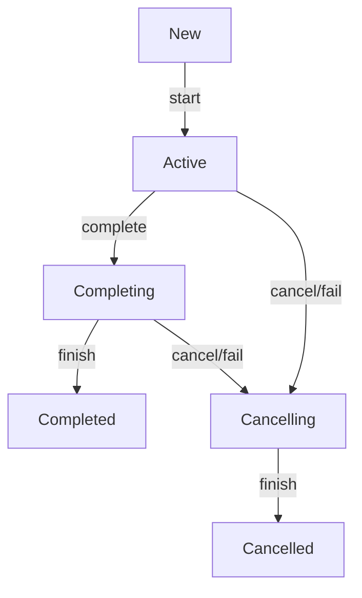

# Coroutines

- https://kotlinlang.org/docs/coroutines-guide.html
- https://github.com/Kotlin/KEEP/blob/master/proposals/coroutines.md

A **<u>coroutine</u>** is an instance of a suspendable computation. It is conceptually similar to a thread, in the sense that it takes a block of code to run that works concurrently with the rest of the code. However, a coroutine is not bound to any particular thread. It may suspend its execution in one thread and resume in another one.

In Java each thread is associated with an instance of the class `Thread`.
In Kotlin such class is [`AbstractCoroutine`](https://github.com/Kotlin/kotlinx.coroutines/blob/master/kotlinx-coroutines-core/common/src/AbstractCoroutine.kt) and [`ScopeCoroutine: AbstractCoroutine`](https://github.com/Kotlin/kotlinx.coroutines/blob/master/kotlinx-coroutines-core/common/src/internal/Scopes.kt)

`CoroutineScope` common [builders](https://github.com/Kotlin/kotlinx.coroutines/blob/master/kotlinx-coroutines-core/common/src/Builders.common.kt) create
- `DeferredCoroutine: AbstractCoroutine`
- `LazyDeferredCoroutine: DeferredCoroutine`
- `StandaloneCoroutine: AbstractCoroutine`
- `LazyStandaloneCoroutine: StandaloneCoroutine`
- `UndispatchedCoroutine: ScopeCoroutine`
- `DispatchedCoroutine: ScopeCoroutine`
And probably some other classes.

None of this classes are instantiated explicitly (like `Thread t = new Thread(...);`).

We use
- `Job` to manage *coroutine* lifecycle and its children
- `Dispatcher` to manage *coroutine* threads
- `CoroutineExceptionHandler` to handle *coroutine* exceptions
- `CoroutineContext` to store, combine and access *coroutine* properties (incl. `Job`, `Dispatcher` and `CoroutineExceptionHandler`)
- `CoroutineScope` to build coroutines and manage them by `CoroutineContext`

```kotlin
fun main() {
	println("Main started")
	GlobalScope.launch { // this: CoroutineScope
		println("Main coroutine started")
	    launch { // launch a new coroutine and continue
	        println("Coroutine started")
	        delay(1000) // non-blocking delay for 1 second
	        println("Coroutine finished")
	    }
	    // main coroutine continues while a previous one is delayed
	    println("Main coroutine finished, but waits until its child finishes")
	}
	println("Main finished")
}
```
```output
Main started
Main coroutine started
Main coroutine finished, but waits until its child finishes
Coroutine started
Coroutine finished
Main finished
```

## [suspend functions](https://kotlinlang.org/docs/composing-suspending-functions.html)

`suspend fun` can *suspend* execution of a coroutine. Suspending functions can be used only inside *coroutines* or other `suspend fun`.

The `suspend` modifier does nothing by itself. The `suspend` modifier indicates that this is a function that can suspend execution of a coroutine. A modifier `suspend` may be used on any function: top-level function, extension function, member function, local function, or operator function.

Suspending functions may invoke any regular functions, but to actually suspend execution they must invoke some other suspending function.

```kotlin
suspend fun doSmth(): Int {
    delay(1000) // executing suspend fun delay
    return 42
}
fun main() = runBlocking {
	val result = doSmth()
    println(result)
}
```

Suspending functions are **sequential by default**.

```kotlin
suspend fun doSomethingUsefulOne(): Int {
    delay(1000) // pretend we are doing something useful here
    return 13
}
suspend fun doSomethingUsefulTwo(): Int {
    delay(1000) // pretend we are doing something useful here, too
    return 29
}

fun main() = runBlocking {
    val time = measureTimeMillis {
        val one = doSomethingUsefulOne()
        val two = doSomethingUsefulTwo()
        println("The answer is ${one + two}")
    }
    println("Completed in $time ms")
}
```
```output
The answer is 42
Completed in 2021 ms
```

When `suspendCoroutine` is called inside a coroutine (and it can _only_ be called inside a coroutine, because it is a suspending function) it captures the execution state of a coroutine in a _continuation_ instance and passes this continuation to the specified `block` as an argument. To resume execution of the coroutine, the block invokes `continuation.resumeWith()` (either directly or using `continuation.resume()` or `continuation.resumeWithException()` extensions) in this thread or in some other thread at some later time. The _actual_ suspension of a coroutine happens when the `suspendCoroutine` block returns without invoking `resumeWith`. If continuation was resumed before returning from inside of the block, then the coroutine is not considered to have been suspended and continues to execute. The result passed to `continuation.resumeWith()` becomes the result of `suspendCoroutine` call, which, in turn, becomes the result of `.await()`.

## Job

- https://kotlinlang.org/api/kotlinx.coroutines/kotlinx-coroutines-core/kotlinx.coroutines/-job/
- https://github.com/Kotlin/kotlinx.coroutines/blob/master/kotlinx-coroutines-core/common/src/Job.kt

A background job. `Job` is an abstraction on *coroutine* lifecycle.

Jobs can be arranged into parent-child hierarchies where cancellation of a parent leads to immediate cancellation of all its children recursively. Failure of a child with an exception other than [CancellationException](https://kotlinlang.org/api/kotlinx.coroutines/kotlinx-coroutines-core/kotlinx.coroutines/-cancellation-exception/index.html) immediately cancels its parent and, consequently, all its other children.

All functions on `Job` interface and on all interfaces derived from it are **thread-safe** and can be safely invoked from concurrent coroutines without external synchronization.

[`CoroutineStart`](https://kotlinlang.org/api/kotlinx.coroutines/kotlinx-coroutines-core/kotlinx.coroutines/-coroutine-start/) defines start options for coroutines builders. It is used in `start` parameter of `launch`, `async`, and other coroutine builder functions.

*Coroutine* start options are:
- [DEFAULT](https://kotlinlang.org/api/kotlinx.coroutines/kotlinx-coroutines-core/kotlinx.coroutines/-coroutine-start/-d-e-f-a-u-l-t/index.html) - immediately schedules coroutine for execution according to its context;
- [LAZY](https://kotlinlang.org/api/kotlinx.coroutines/kotlinx-coroutines-core/kotlinx.coroutines/-coroutine-start/-l-a-z-y/index.html) - starts coroutine lazily, only when it is needed;
- [ATOMIC](https://kotlinlang.org/api/kotlinx.coroutines/kotlinx-coroutines-core/kotlinx.coroutines/-coroutine-start/-a-t-o-m-i-c/index.html) - atomically (in a non-cancellable way) schedules coroutine for execution according to its context;
- [UNDISPATCHED](https://kotlinlang.org/api/kotlinx.coroutines/kotlinx-coroutines-core/kotlinx.coroutines/-coroutine-start/-u-n-d-i-s-p-a-t-c-h-e-d/index.html) - immediately executes coroutine until its first suspension point _in the current thread_.

### Job States

A job has the following states:

- ***New*** (optional initial state) - coroutine is created with `CoroutineStart.LAZY`
- ***Active*** (default initial state)- coroutine is created with `CoroutineStart.DEFAULT` or started with `.start()` or `.join()`. A job is *active* while the coroutine is working or until it fails or cancelled.
- ***Completing*** (transient state) - Completion of an *active* coroutine's body transitions the job to the *completing* state.
- ***Cancelling*** (transient state) - Failure of an *active* job with an exception makes it *cancelling*. A job can be cancelled at any time with `cancel` function that forces it to transition to the *cancelling* state immediately.
- ***Cancelled*** (final state) - The *cancelling* job becomes *cancelled* when it finishes executing its work **and all its children complete**.
- ***Completed*** (final state) - The *completing* job becomes *completed* when it finishes executing its work **and all its children complete**. This state is purely internal to the job. For an outside observer a *completing* job is still *active*.

| **State**        | .isActive | .isCompleted | .isCancelled |
| ---------------- | --------- | ------------ | ------------ |
| ***New***        | `false`   | `false`      | `false`      |
| ***Active***     | `true`    | `false`      | `false`      |
| ***Completing*** | `true`    | `false`      | `false`      |
| ***Cancelling*** | `false`   | `false`      | `true`       |
| ***Cancelled***  | `false`   | `true`       | `true`       |
| ***Completed***  | `false`   | `true`       | `false`      |



### Job Hierarchy

A `Job` becomes a child of this `Job` when it is constructed with this job in its CoroutineContext or using an explicit `parent` parameter.

- [`children: Sequence<Job>`](https://kotlinlang.org/api/kotlinx.coroutines/kotlinx-coroutines-core/kotlinx.coroutines/-job/children.html) Returns a sequence of this job's children.
- [`parent: Job?`](https://kotlinlang.org/api/kotlinx.coroutines/kotlinx-coroutines-core/kotlinx.coroutines/-job/parent.html) Returns the parent of the current job if the parent-child relationship is established or `null` if the job has no parent or was successfully completed.

A parent-child relation has the following effect:

- Cancellation of parent with `cancel()` or its exceptional completion (failure) immediately cancels all its children.
- Parent cannot complete until all its children are complete. Parent waits for all its children to complete in *completing* or *cancelling* state.
- Uncaught exception in a child, by default, cancels parent. This applies even to children created with `async` and other future-like *coroutine builders*, even though their exceptions are caught and are encapsulated in their result.

### Job.Key

```kotlin
public interface Job : CoroutineContext.Element {
	public companion object Key : CoroutineContext.Key<Job>
	...
}
```

Key for `Job` instance in the `CoroutineContext`. This object allows to get a job instance from `CoroutineContext` with `coroutineContext[Job]`.

### Start and Join

#### [`start(): Boolean`](https://kotlinlang.org/api/kotlinx.coroutines/kotlinx-coroutines-core/kotlinx.coroutines/-job/start.html)

Starts coroutine related to this job (if any) if it was not started yet. The result is `true` if this invocation actually started coroutine or `false` if it was already started or completed.

#### [`suspend join()`](https://kotlinlang.org/api/kotlinx.coroutines/kotlinx-coroutines-core/kotlinx.coroutines/-job/join.html)

Suspends the coroutine until this `Job` is complete. This invocation resumes normally (without exception) when the `Job` is complete for any reason and the `Job` of the invoking coroutine is still *active*. This function also starts the corresponding coroutine if the `Job` was still in *new* state.

This suspending function is cancellable and **always** checks for a cancellation of the invoking coroutine's `Job`. If the `Job` of the invoking coroutine is *cancelled* or *completed* when this suspending function is invoked or while it is suspended, this function throws `CancellationException`. In particular, it means that a parent coroutine invoking `join` on a child coroutine throws `CancellationException` if the child had failed, since a failure of a child coroutine cancels parent by default.

### Cancel


#### [CancellationException](https://kotlinlang.org/api/kotlinx.coroutines/kotlinx-coroutines-core/kotlinx.coroutines/-cancellation-exception/index.html)

### [**CompletableJob**](https://kotlinlang.org/api/kotlinx.coroutines/kotlinx-coroutines-core/kotlinx.coroutines/-completable-job/index.html)

### [SupervisorJob](https://kotlinlang.org/api/kotlinx.coroutines/kotlinx-coroutines-core/kotlinx.coroutines/-supervisor-job.html)


## Dispatcher


## CoroutineExceptionHandler


## CoroutineContext

- https://kotlinlang.org/docs/coroutine-context-and-dispatchers.html
- https://kotlinlang.org/api/latest/jvm/stdlib/kotlin.coroutines/-coroutine-context/

The `CoroutineContext` is a set of various elements. The main elements are the `Job` of the coroutine and its `Dispatcher`.

[source](https://github.com/JetBrains/kotlin/blob/master/libraries/stdlib/src/kotlin/coroutines/CoroutineContext.kt)
```kotlin
public interface CoroutineContext {
    public operator fun <E : Element> get(key: Key<E>): E?
    /* Accumulates entries of this context starting with [initial] value and applying [operation] from left to right to current accumulator value and each element of this context. */
    public fun <R> fold(initial: R, operation: (R, Element) -> R): R

    /* Returns a context containing elements from this context and elements from the other [context]. The elements from this context with the same key as in the other one are dropped. */
    public operator fun plus(context: CoroutineContext): CoroutineContext {...}

// Returns a context containing elements from this context, but without an element with the specified [key].
    public fun minusKey(key: Key<*>): CoroutineContext
	
	// Key for the elements of [CoroutineContext].
    public interface Key<E : Element>

    /* An element of the [CoroutineContext]. An element of the coroutine context is a singleton context by itself. */
    public interface Element : CoroutineContext {
        public val key: Key<*>
        public override operator fun <E : Element> get(key: Key<E>): E? =
            @Suppress("UNCHECKED_CAST")
            if (this.key == key) this as E else null
        public override fun <R> fold(initial: R, operation: (R, Element) -> R): R =
            operation(initial, this)
        public override fun minusKey(key: Key<*>): CoroutineContext =
            if (this.key == key) EmptyCoroutineContext else this
    }
}
```


## CoroutineScope

- https://kotlinlang.org/api/kotlinx.coroutines/kotlinx-coroutines-core/kotlinx.coroutines/-coroutine-scope/
- https://github.com/Kotlin/kotlinx.coroutines/blob/master/kotlinx-coroutines-core/common/src/CoroutineScope.kt

Defines a scope for new coroutines.

```kotlin
public interface CoroutineScope {
    public val coroutineContext: CoroutineContext
}
```

`CoroutineContext` is encapsulated by the `CoroutineScope` and used for implementation of *coroutine builders* that are extensions on the `CoroutineScope`. Accessing `coroutineContext` property in general code is not recommended for any purposes except accessing the `coroutineContext[Job]` instance for advanced usages.

CoroutineScope provides functionality of `CoroutineContext` and its children via extentions:

```kotlin
public operator fun CoroutineScope.plus(context: CoroutineContext): CoroutineScope =
    ContextScope(coroutineContext + context)

public val CoroutineScope.isActive: Boolean
    get() = coroutineContext[Job]?.isActive ?: true

public fun CoroutineScope.cancel(cause: CancellationException? = null) {
    val job = coroutineContext[Job] ?: error("Scope cannot be cancelled because it does not have a job: $this")
    job.cancel(cause)
}
public fun CoroutineScope.cancel(message: String, cause: Throwable? = null): Unit = 
	cancel(CancellationException(message, cause))

public fun CoroutineScope.ensureActive(): Unit = coroutineContext.ensureActive()


public suspend inline fun currentCoroutineContext(): CoroutineContext = coroutineContext
```

Default `CoroutineScope`s:

```kotlin
public fun MainScope(): CoroutineScope =
	ContextScope(SupervisorJob() + Dispatchers.Main)

public object GlobalScope : CoroutineScope {
    override val coroutineContext: CoroutineContext
        get() = EmptyCoroutineContext
}

public fun CoroutineScope(context: CoroutineContext): CoroutineScope =
    ContextScope(if (context[Job] != null) context else context + Job())

```

```kotlin
public suspend fun <R> coroutineScope(block: suspend CoroutineScope.() -> R): R { ... }
```

