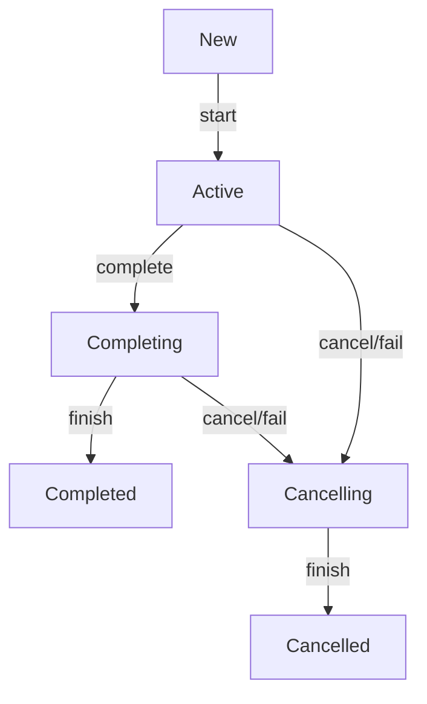

# Coroutines

- [Kotlin Coroutines guide](https://kotlinlang.org/docs/coroutines-guide.html)
- [Coroutines design document (KEEP)](https://github.com/Kotlin/KEEP/blob/master/proposals/coroutines.md)

## Intro ✅

A **<u>coroutine</u>** is an instance of a suspendable computation. It is conceptually similar to a thread, in the sense that it takes a block of code to run that works concurrently with the rest of the code. However, a coroutine is not bound to any particular thread. It may suspend its execution in one thread and resume in another one.

In Java each thread is associated with an instance of the class `Thread`.
In Kotlin such class is [`AbstractCoroutine`](https://github.com/Kotlin/kotlinx.coroutines/blob/master/kotlinx-coroutines-core/common/src/AbstractCoroutine.kt) or [`ScopeCoroutine: AbstractCoroutine`](https://github.com/Kotlin/kotlinx.coroutines/blob/master/kotlinx-coroutines-core/common/src/internal/Scopes.kt)

`CoroutineScope` common [builders](https://github.com/Kotlin/kotlinx.coroutines/blob/master/kotlinx-coroutines-core/common/src/Builders.common.kt) create
- `DeferredCoroutine: AbstractCoroutine`
- `LazyDeferredCoroutine: DeferredCoroutine`
- `StandaloneCoroutine: AbstractCoroutine`
- `LazyStandaloneCoroutine: StandaloneCoroutine`
- `UndispatchedCoroutine: ScopeCoroutine`
- `DispatchedCoroutine: ScopeCoroutine`
And probably some other classes.

None of this classes are instantiated explicitly (like `Thread t = new Thread(...);`).

In practice we use:

- `CoroutineContext` to store, combine and access *coroutine* properties (incl. `Job`, `CoroutineDispatcher` and `CoroutineExceptionHandler`)
- `CoroutineScope` (that incapsulates `CoroutineContext`) to build coroutines and manage them by `CoroutineContext` elements.

This is only an illustration of using coroutines:

```kotlin
fun main() {  
    println("Main started")  
    val mainJob = CoroutineScope(Dispatchers.Default).launch { // this: CoroutineScope  
        println("Main coroutine started")  
        launch { // launch a new coroutine and continue  
            println("Coroutine started")  
            delay(1000) // non-blocking delay for 1 second  
            println("Coroutine finished")  
        }  
        // main coroutine continues while a previous one is delayed  
        println("Main coroutine finished, but waits until its child finishes")  
    }
    runBlocking { mainJob.join() } // process will be finished otherwise
    println("Main finished")
}
```
```output
Main started
Main coroutine started
Main coroutine finished, but waits until its child finishes
Coroutine started
Coroutine finished
Main finished
```

## [suspend functions](https://kotlinlang.org/docs/composing-suspending-functions.html)

`suspend fun` can *suspend* execution of a coroutine. Suspending functions can be used only inside coroutines or other `suspend fun`.

The `suspend` modifier does nothing by itself. The `suspend` modifier indicates that this is a function that can suspend execution of a coroutine. A modifier `suspend` may be used on any function: top-level function, extension function, member function, local function, or operator function.

Suspending functions may invoke any regular functions, but to actually suspend execution they must invoke some other suspending function.

```kotlin
suspend fun doSmth(): Int {
    delay(1000) // executing suspend fun delay
    return 42
}
fun main() = runBlocking {
	val result = doSmth()
    println(result)
}
```

Suspending functions are **sequential by default**.

```kotlin
suspend fun doSomethingUsefulOne(): Int {
    delay(1000) // pretend we are doing something useful here
    return 13
}
suspend fun doSomethingUsefulTwo(): Int {
    delay(1000) // pretend we are doing something useful here, too
    return 29
}

fun main() = runBlocking {
    val time = measureTimeMillis {
        val one = doSomethingUsefulOne()
        val two = doSomethingUsefulTwo()
        println("The answer is ${one + two}")
    }
    println("Completed in $time ms")
}
```
```output
The answer is 42
Completed in 2021 ms
```

When `suspendCoroutine` is called inside a coroutine (and it can _only_ be called inside a coroutine, because it is a suspending function) it captures the execution state of a coroutine in a _continuation_ instance and passes this continuation to the specified `block` as an argument. To resume execution of the coroutine, the block invokes `continuation.resumeWith()` (either directly or using `continuation.resume()` or `continuation.resumeWithException()` extensions) in this thread or in some other thread at some later time. The _actual_ suspension of a coroutine happens when the `suspendCoroutine` block returns without invoking `resumeWith`. If continuation was resumed before returning from inside of the block, then the coroutine is not considered to have been suspended and continues to execute. The result passed to `continuation.resumeWith()` becomes the result of `suspendCoroutine` call, which, in turn, becomes the result of `.await()`.

[`coroutineContext`](https://kotlinlang.org/api/core/kotlin-stdlib/kotlin.coroutines/coroutine-context.html) is a top-level property that is available in all suspending functions to retrieve the `CoroutineContext` of the current coroutine.

[currentCoroutineContext](https://kotlinlang.org/api/kotlinx.coroutines/kotlinx-coroutines-core/kotlinx.coroutines/current-coroutine-context.html) returns the current `CoroutineContext` retrieved by using `coroutineContext`. This function is an alias to avoid name clash with `CoroutineScope.coroutineContext` in a receiver position.

## CoroutineContext ✅

- [Kotlin Coroutines guide](https://kotlinlang.org/docs/coroutine-context-and-dispatchers.html)
- [API docs](https://kotlinlang.org/api/core/kotlin-stdlib/kotlin.coroutines/-coroutine-context/)
- [Coroutines design document (KEEP)](https://github.com/Kotlin/KEEP/blob/master/proposals/coroutines.md#coroutine-context)
- [Source code](https://github.com/JetBrains/kotlin/blob/master/libraries/stdlib/src/kotlin/coroutines/CoroutineContext.kt)

`CoroutineСontext` is a persistent set of user-defined objects that can be attached to the coroutine. Each coroutine always executes in the context represented by elements of `CoroutineСontext`, which are responsible for various aspects of coroutine execution.

`CoroutineСontext` is an indexed set of elements, where each element has a unique key. It is a mix between a set and a map.

```kotlin
public interface CoroutineContext {
    public operator fun <E : Element> get(key: Key<E>): E?
	...
	// Key for the elements of [CoroutineContext].
    public interface Key<E : Element>
    // An element of the [CoroutineContext]. An element of the coroutine context is a singleton context by itself.
    public interface Element : CoroutineContext {
        public val key: Key<*>
        public override operator fun <E : Element> get(key: Key<E>): E? =
            @Suppress("UNCHECKED_CAST")
            if (this.key == key) this as E else null
        ...
    }
}
```

During this section we consider the following objects only like elements of `CoroutineСontext`. Their detailed explanation is described further.

### `CoroutineСontext` elements:

#### Job

`Job` allows to manage coroutine lifecycle and its children.

```kotlin
public interface Job : CoroutineContext.Element {
    // Key for [Job] instance in the coroutine context.
    public companion object Key : CoroutineContext.Key<Job>
```

#### CoroutineDispatcher

`CoroutineDispatcher` allows to manage coroutine threads policy.

```kotlin
public abstract class CoroutineDispatcher :
    AbstractCoroutineContextElement(ContinuationInterceptor), ... {
    public companion object Key : AbstractCoroutineContextKey<ContinuationInterceptor, CoroutineDispatcher>(
        ContinuationInterceptor,
        { it as? CoroutineDispatcher })
```

#### CoroutineExceptionHandler

`CoroutineExceptionHandler` allows to handle coroutine exceptions.

```kotlin
public interface CoroutineExceptionHandler : CoroutineContext.Element {
    // Key for [CoroutineExceptionHandler] instance in the coroutine context.
    public companion object Key : CoroutineContext.Key<CoroutineExceptionHandler>
```

#### CoroutineName

`CoroutineName` allows to add a `String` name to a coroutine.

```kotlin
public data class CoroutineName(...) : AbstractCoroutineContextElement(CoroutineName) {
	// Key for [CoroutineName] instance in the coroutine context.
    public companion object Key : CoroutineContext.Key<CoroutineName>
```


#### Custom `CoroutineContext.Element`

All third-party context elements shall extend [`AbstractCoroutineContextElement`](https://kotlinlang.org/api/core/kotlin-stdlib/kotlin.coroutines/-abstract-coroutine-context-element/) class. The following style is recommended for library defined context elements. The example below shows a hypothetical authorization context element that stores current user name:

```kotlin
class AuthUser(val name: String) : AbstractCoroutineContextElement(AuthUser) {
    companion object Key : CoroutineContext.Key<AuthUser>
}
// inside of coroutine:
suspend fun doSomething() {
    val currentUser = coroutineContext[AuthUser]?.name ?: throw SecurityException("unauthorized")
    // do something user-specific
}
```

### `CoroutineСontext` composition

Thus, each element [`CoroutineСontext.Element`](https://kotlinlang.org/api/core/kotlin-stdlib/kotlin.coroutines/-coroutine-context/-element/) of the `CoroutineСontext` **IS** `CoroutineСontext` itself (as it implements ` : CoroutineContext.Element : CoroutineContext`). An element of the coroutine context is a singleton context by itself.

```kotlin
val job: CoroutineContext = Job() // this is not constructor, as Job is an interface. Job() is the function
```

`companion object Key` allows to `get` elements of `CoroutineСontext` by class (as `companion object` resolved statically):

```kotlin
// we can get an element of CoroutineContext with its
// operator fun <E : CoroutineContext.Element> get(key: CoroutineContext.Key<E>): E?
val job = coroutineContext[Job.Key] // Job.Key : CoroutineContext.Key<Job>
// or just
val job = coroutineContext[Job] // here Job is treated as its companion object Key
```

e.g., creating a new `Job`, we are also creating `CoroutineContext` that contains that `Job` as its element:

```kotlin
val job = Job()
assert(job == job[Job]) // true
```

Job can always be retrieved from `CoroutineContext` with `.job`:

```kotlin
coroutineContext[Job] == coroutineContext.job
```

`CoroutineСontext` also provides `fold`, `plus` and `minusKey` functions, which allows to compose `CoroutineСontext`s.

```kotlin
    // Accumulates entries of this context starting with [initial] value and applying [operation] from left to right to current accumulator value and each element of this context.
    public fun <R> fold(initial: R, operation: (R, Element) -> R): R

	// Returns a context containing elements from this context and elements from the other [context]. The elements from this context with the same key as in the other one are dropped.
    public operator fun plus(context: CoroutineContext): CoroutineContext {...}

	// Returns a context containing elements from this context, but without an element with the specified [key].
    public fun minusKey(key: Key<*>): CoroutineContext

	public interface Element : CoroutineContext {
		...
        public override fun <R> fold(initial: R, operation: (R, Element) -> R): R =
            operation(initial, this)
        public override fun minusKey(key: Key<*>): CoroutineContext =
            if (this.key == key) EmptyCoroutineContext else this
```

`operator fun plus` union `CoroutineСontext` sets with priority to the elements of the right operand:

```
CoroutineContext_A { Job_A, CoroutineDispatcher_A }
+
CoroutineContext_B { Job_B, CoroutineExceptionHandler_B }
=
CoroutineContext_C { Job_B, CoroutineDispatcher_A, CoroutineExceptionHandler_B }
```

Thus we can construct `CoroutineСontext` using its elements (as each element of the `CoroutineСontext` is `CoroutineСontext`):

```kotlin
val coroutineContext = Job() + Dispatchers.Default + CoroutineExceptionHandler{_,_->}  
coroutineContext.fold(""){ str, elem -> "".also { println(elem) } }
```
```output
JobImpl{Active}@5e265ba4
ThreadsKt$main$$inlined$CoroutineExceptionHandler$1@156643d4
Dispatchers.Default
```

```kotlin
fun CoroutineContext.print() = println(fold(""){ str, elem -> "$str$elem; " })  
val coroutineContextA = Job() + Dispatchers.Default  
val coroutineContextB = Job() + CoroutineExceptionHandler {_,_->}  
val coroutineContext = coroutineContextA + coroutineContextB  
coroutineContextA.print()  
println("+")  
coroutineContextB.print()  
println("=")  
coroutineContext.print()
```
```output
JobImpl{Active}@123772c4; Dispatchers.Default; 
+
JobImpl{Active}@2d363fb3; ThreadsKt$main$$inlined$CoroutineExceptionHandler$1@7d6f77cc; 
=
JobImpl{Active}@2d363fb3; ThreadsKt$main$$inlined$CoroutineExceptionHandler$1@7d6f77cc; Dispatchers.Default; 
```

Standard library provides [`EmptyCoroutineContext`](https://kotlinlang.org/api/core/kotlin-stdlib/kotlin.coroutines/-empty-coroutine-context/) — an instance of `CoroutineContext` without any elements (empty).

**`CoroutineСontext` is immutable**. Each time, we compose contexts, or modify any one, we get a new `CoroutineСontext`. e.g.:

```kotlin
val nameContext = CoroutineName("Some name")  
val context = nameContext + Dispatchers.Default  
val job = CoroutineScope(context).launch {  
    delay(100)  
    println("coroutineContext = $coroutineContext")  
    println("inside coroutine: ${coroutineContext[CoroutineName]}")  
}  
println("nameContext = $nameContext")  
println("context = $context")  
println("job = $job")  
println("job[CoroutineName] = ${job[CoroutineName]}") // null  
job.join()  
// BUT  
val coroutineContext = (job as CoroutineScope).coroutineContext  
println("context == coroutineContext is ${context == coroutineContext}")  
println("outside coroutine: ${coroutineContext[CoroutineName]}")
```
```output
nameContext = CoroutineName(Some name)
context = [CoroutineName(Some name), Dispatchers.Default]
job = StandaloneCoroutine{Active}@1ef7fe8e
job[CoroutineName] = null
coroutineContext = [CoroutineName(Some name), StandaloneCoroutine{Active}@1ef7fe8e, Dispatchers.Default]
inside coroutine: CoroutineName(Some name)
context == coroutineContext is false
outside coroutine: CoroutineName(Some name)
```

## Job

- [Kotlin API docs: Job](https://kotlinlang.org/api/kotlinx.coroutines/kotlinx-coroutines-core/kotlinx.coroutines/-job/)
- [Job source code](https://github.com/Kotlin/kotlinx.coroutines/blob/master/kotlinx-coroutines-core/common/src/Job.kt)

A background job. `Job` is an abstraction on *coroutine* lifecycle.

All functions on `Job` interface and on all interfaces derived from it are **thread-safe** and can be safely invoked from concurrent coroutines without external synchronization.

A `Job` can be created using the standard function [`Job(parent:Job?)`](https://kotlinlang.org/api/kotlinx.coroutines/kotlinx-coroutines-core/kotlinx.coroutines/-job.html), but usually a `Job` is created with *coroutine builders*.

```kotlin
// using fun Job():
val job = Job() // this is not a Job constructor, as Job is an interface
// using coroutine builder launch {}:
val job = launch {...}
```

**`launch` always creates a new couroutine and a `Job` associated with it.** There is no way to provide an existing `Job` instance for `launch`.

`launch` returns the `Job` only. There is no other elements of `CoroutineContext` of `CoroutineScope` of `launch` presented in this `Job`. But this `Job` is also the `StandaloneCoroutine`, which `: CoroutineScope`. We can get `coroutineContext` of launched coroutine from it:

```kotlin
val job = CoroutineScope(  
    Dispatchers.Default  
    + CoroutineName("Some name")
).launch {  
    println("coroutineContext = $coroutineContext")  
    println("inside coroutine: CoroutineName = ${coroutineContext[CoroutineName]}")  
    delay(100)  
}  
delay(100)  
println("job = $job")  
println("outside coroutine: CoroutineName = ${job[CoroutineName]}") // null
// BUT  
val coroutineContext = (job as CoroutineScope).coroutineContext  
println("outside coroutine: CoroutineName = ${coroutineContext[CoroutineName]}")
job.join()
```
```output
coroutineContext = [CoroutineName(Some name), StandaloneCoroutine{Active}@2c9b3971, Dispatchers.Default]
inside coroutine: CoroutineName = CoroutineName(Some name)
job = StandaloneCoroutine{Active}@2c9b3971
outside coroutine: CoroutineName = null
outside coroutine: CoroutineName = CoroutineName(Some name)
```

### Job States ✅

A job has the following states:

- ***New*** (optional initial state) - coroutine is created with `start=CoroutineStart.LAZY`
- ***Active*** (default initial state)- coroutine is created with `start=CoroutineStart.DEFAULT` or started with `.start()` or `.join()`. A job is *active* while the coroutine is working or until it fails or cancelled.
- ***Completing*** (transient state) - Completion of an *active* coroutine's body transitions the job to the *completing* state.
- ***Cancelling*** (transient state) - Failure of an *active* job with an exception makes it *cancelling*. A job can be cancelled at any time with `cancel` function that forces it to transition to the *cancelling* state immediately.
- ***Cancelled*** (final state) - The *cancelling* job becomes *cancelled* when it finishes executing its work **and all its children complete**.
- ***Completed*** (final state) - The *completing* job becomes *completed* when it finishes executing its work **and all its children complete**. This state is purely internal to the job. For an outside observer a *completing* job is still *active*.

| **State**        | .isActive | .isCompleted | .isCancelled |
| ---------------- | --------- | ------------ | ------------ |
| ***New***        | `false`   | `false`      | `false`      |
| ***Active***     | `true`    | `false`      | `false`      |
| ***Completing*** | `true`    | `false`      | `false`      |
| ***Cancelling*** | `false`   | `false`      | `true`       |
| ***Cancelled***  | `false`   | `true`       | `true`       |
| ***Completed***  | `false`   | `true`       | `false`      |



#### New -> Active -> Completing -> Completed

```kotlin
val printJobState = {j: Job ->  
    println("${j.toString().replace("LazyStandaloneCoroutine","coroutine").split("@")[0]}; " +  
            "isActive = ${j.isActive}; " +  
            "isCompleted = ${j.isCompleted}; " +  
            "isCancelled = ${j.isCancelled}") }  
val job = CoroutineScope(Dispatchers.Default).launch(start = CoroutineStart.LAZY) {  
    println("job started")  
    launch {  
        println("child job started")  
        delay(300)  
        println("child job finished")  
    }  
    delay(100)  
    println("job finished")  
}  
println("job created")  
printJobState(job)  
println("start job")  
job.start()  
printJobState(job)  
delay(200)  
printJobState(job)  
delay(200)  
printJobState(job)
```
```output
job created
coroutine{New}; isActive = false; isCompleted = false; isCancelled = false
start job
coroutine{Active}; isActive = true; isCompleted = false; isCancelled = false
job started
child job started
job finished
coroutine{Completing}; isActive = true; isCompleted = false; isCancelled = false
child job finished
coroutine{Completed}; isActive = false; isCompleted = true; isCancelled = false
```

#### New -> Active -> Cancelling (by cancel) -> Cancelled

```kotlin
val printJobState = {j: Job ->  
    println("${j.toString().replace("LazyStandaloneCoroutine","coroutine").split("@")[0]}; " +  
            "isActive = ${j.isActive}; " +  
            "isCompleted = ${j.isCompleted}; " +  
            "isCancelled = ${j.isCancelled}") }  
val lock = Any()  
var doFinish = false  
val job = CoroutineScope(Dispatchers.Default).launch(start = CoroutineStart.LAZY) {  
    println("job started")  
    launch {  
	    println("child job started")  
        try {
            delay(300)  
        } catch (c: CancellationException){  
            println("child job ignoring cancelling")  
        } finally {  
            // if coroutine is cancelled,  
            // any suspend fun invocation will throw another CancellationException here            while (!synchronized(lock){ doFinish }){} // finishing some important work  
            println("child job finished")  
        }  
    }  
    delay(200)  
    println("job finished")  
}  
println("job created")  
printJobState(job)  
println("start job")  
job.start()  
printJobState(job)  
delay(100)  
println("cancel job")  
job.cancel()  
printJobState(job)  
delay(100)  
synchronized(lock){ doFinish = true }  
delay(100)  
printJobState(job)
```
```output
job created
coroutine{New}; isActive = false; isCompleted = false; isCancelled = false
start job
coroutine{Active}; isActive = true; isCompleted = false; isCancelled = false
job started
child job started
cancel job
coroutine{Cancelling}; isActive = false; isCompleted = false; isCancelled = true
child job ignoring cancelling
child job finished
coroutine{Cancelled}; isActive = false; isCompleted = true; isCancelled = true
```

#### New -> Active -> Cancelling (by throwing) -> Cancelled

```kotlin
val printJobState = {j: Job ->  
    println("${j.toString().replace("LazyStandaloneCoroutine","coroutine").split("@")[0]}; " +  
            "isActive = ${j.isActive}; " +  
            "isCompleted = ${j.isCompleted}; " +  
            "isCancelled = ${j.isCancelled}") }  
val lock = Any()  
var doFinish = false  
val job = CoroutineScope(  
    Dispatchers.Default  
            + CoroutineExceptionHandler { _, e -> println("Exception in coroutine") }  
).launch(start = CoroutineStart.LAZY) {  
    println("job started")  
    launch {  
	    println("child job started")  
        try {
            delay(300)  
        } catch (c: CancellationException){  
            println("child job ignoring cancelling")  
        } finally {  
            // if coroutine is cancelled,
            // any suspend fun invocation throws another CancellationException here  
            while (!synchronized(lock){ doFinish }){} // finishing some important work  
            println("child job finished")  
        }  
    }  
    delay(100)  
    println("throwing Exception")  
    throw Exception()  
    println("job finished")  
}  
println("job created")  
printJobState(job)  
println("start job")  
job.start()  
printJobState(job)  
delay(200)  
printJobState(job)  
delay(100)  
synchronized(lock){ doFinish = true }  
delay(100)  
printJobState(job)
```
```output
job created
coroutine{New}; isActive = false; isCompleted = false; isCancelled = false
start job
coroutine{Active}; isActive = true; isCompleted = false; isCancelled = false
job started
child job started
throwing Exception
child job ignoring cancelling
coroutine{Cancelling}; isActive = false; isCompleted = false; isCancelled = true
child job finished
Exception in coroutine
coroutine{Cancelled}; isActive = false; isCompleted = true; isCancelled = true
```

### Structured Concurrency ✅

Jobs can be arranged into parent-child hierarchies where cancellation of a parent leads to immediate cancellation of all its children recursively. Failure of a child with an exception other than `CancellationException` immediately cancels its parent and, consequently, all its other children.

- [`children: Sequence<Job>`](https://kotlinlang.org/api/kotlinx.coroutines/kotlinx-coroutines-core/kotlinx.coroutines/-job/children.html) Returns a sequence of this job's children.
- [`parent: Job?`](https://kotlinlang.org/api/kotlinx.coroutines/kotlinx-coroutines-core/kotlinx.coroutines/-job/parent.html) Returns the parent of the current job if the parent-child relationship is established or `null` if the job has no parent or was successfully completed.

#### Building `Job` relationships with `CoroutineContext`

A `Job C` becomes a child of `Job P` when it is constructed with this `Job P` in its `CoroutineContext` ([Kotlin API docs: Job.children](https://kotlinlang.org/api/kotlinx.coroutines/kotlinx-coroutines-core/kotlinx.coroutines/-job/children.html)).

```kotlin
val parentJob = launch {  
    println("inside of launch parentJob = ${coroutineContext.job}")  
    val childJob1 = launch {  
        delay(100)  
        println("inside of launch childJob1 = ${coroutineContext.job}")  
        println("childJob1.parent = ${coroutineContext.job.parent}")  
        delay(300)  
    }  
    println("childJob1 = $childJob1")  
    val childJob2 = launch {  
        delay(200)  
        println("inside of launch childJob2 = ${coroutineContext.job}")  
        println("childJob2.parent = ${coroutineContext.job.parent}")  
        delay(200)  
    }  
    println("childJob2 = $childJob2")  
    println("inside of launch parentJob.children:")  
    coroutineContext.job.children.forEach { println(it) }  
}  
delay(300)  
println("parentJob = $parentJob")  
println("parentJob.children:")  
parentJob.children.forEach { println(it) }
```
```output:
inside of launch parentJob = StandaloneCoroutine{Active}@63d4e2ba
childJob1 = StandaloneCoroutine{Active}@33a10788
childJob2 = StandaloneCoroutine{Active}@7cdbc5d3
inside of launch parentJob.children:
StandaloneCoroutine{Active}@33a10788
StandaloneCoroutine{Active}@7cdbc5d3
inside of launch childJob1 = StandaloneCoroutine{Active}@33a10788
childJob1.parent = StandaloneCoroutine{Completing}@63d4e2ba
inside of launch childJob2 = StandaloneCoroutine{Active}@7cdbc5d3
childJob2.parent = StandaloneCoroutine{Completing}@63d4e2ba
parentJob = StandaloneCoroutine{Completing}@63d4e2ba
parentJob.children:
StandaloneCoroutine{Active}@33a10788
StandaloneCoroutine{Active}@7cdbc5d3
```

##### How this works:

`launch` is the extension fun of `CoroutineScope`. It use  its parent's `CoroutineContext` to build  the new child's `CoroutineContext`, which uses parent's `CoroutineContext` elements, but the new child `Job`. This child `Job` is attached to the parent `Job` (which can be retrieved from parent's `CoroutineContext`) and returned from `launch { }`.

[`launch`](https://github.com/Kotlin/kotlinx.coroutines/blob/master/kotlinx-coroutines-core/common/src/Builders.common.kt) creates a context with:

```kotlin
public fun CoroutineScope.launch(
    context: CoroutineContext = EmptyCoroutineContext,
    start: CoroutineStart = CoroutineStart.DEFAULT,
    block: suspend CoroutineScope.() -> Unit
): Job {
    val newContext = newCoroutineContext(context)
	...
```

[`expect newCoroutineContext()`](https://github.com/Kotlin/kotlinx.coroutines/blob/master/kotlinx-coroutines-core/common/src/CoroutineContext.common.kt), [`actual newCoroutineContext()`](https://github.com/Kotlin/kotlinx.coroutines/blob/master/kotlinx-coroutines-core/jvm/src/CoroutineContext.kt):

```kotlin
public expect fun CoroutineScope.newCoroutineContext(context: CoroutineContext): CoroutineContext
public actual fun CoroutineScope.newCoroutineContext(context: CoroutineContext): CoroutineContext {  
    val combined = foldCopies(coroutineContext, context, true)
    // here coroutineContext is parent
    // context = EmptyCoroutineContext (if launch with default param)
    // fold essentially + contexts
```

Thus, `val newContext = coroutineContext` in `CoroutineScope.launch`.

`launch` returns [`StandaloneCoroutine`](https://github.com/Kotlin/kotlinx.coroutines/blob/master/kotlinx-coroutines-core/common/src/Builders.common.kt) which is [`AbstractCoroutine<Unit>(parentContext, initParentJob = true,...`](https://github.com/Kotlin/kotlinx.coroutines/blob/master/kotlinx-coroutines-core/common/src/AbstractCoroutine.kt), that has:

```kotlin
public abstract class AbstractCoroutine<in T>(
    parentContext: CoroutineContext,
    initParentJob: Boolean,
    active: Boolean
) : JobSupport(active), Job,... {
	init {
	    /*
	     * Setup parent-child relationship between the parent in the context
	     * and the current coroutine.
	     * It may cause this coroutine to become _cancelling_
	     * if the parent is already cancelled.
	     * It is dangerous to install parent-child relationship here if the coroutine class
	     * operates its state from within onCancelled or onCancelling
	     * (with exceptions for rx integrations that can't have any parent)
	     */
	    if (initParentJob) initParentJob(parentContext[Job])
	}
```

[`initParentJob`](https://github.com/Kotlin/kotlinx.coroutines/blob/master/kotlinx-coroutines-core/common/src/JobSupport.kt) is:

```kotlin
public open class JobSupport (active: Boolean) : Job, ChildJob, ParentJob {
...
    protected fun initParentJob(parent: Job?) {
        ...
        parent.start() // make sure the parent is started
        @Suppress("DEPRECATION")
        val handle = parent.attachChild(this) // this: JobSupport: ChildJob
```


#### Building `Job` relationships with `launch(context){}`

We can establish parent-child relationships with `context` parameter of `lauch {}` coroutine builder:

[launch](https://kotlinlang.org/api/kotlinx.coroutines/kotlinx-coroutines-core/kotlinx.coroutines/launch.html):
> The coroutine context is inherited from the `CoroutineScope`. Additional context elements can be specified with `context` argument. The parent job is inherited from a `CoroutineScope` as well, but it can also be overridden with a corresponding `context` element.

**IMPORTANT NOTICE**: `launch` always creates a new couroutine and, consequently, associated `Job`.

```kotlin
val parentJob = someScope.launch {...}
val childJob = someOtherScope.launch(context = parentJob) {...}
```

Note that in such case, no other `CoroutineContext` elements are inherited from `someScope`, as `parentJob` is the `Job` only.

We can achieve the same results with the previous approach:

```kotlin
val parentJob = someScope.launch {
	...
	val childJob = someOtherScope.launch {...}
}
```

Here `parentJob` and `childJob` have different `CoroutineScope` (`CoroutineContext` elements), but they are still in a parent-child relationships.

```kotlin
val parentJob = CoroutineScope(Dispatchers.Default).launch {  
    delay(100)  
    println("inside of launch parentJob = ${coroutineContext.job}")  
    delay(250)  
    println("inside of launch parentJob.children:")  
    coroutineContext.job.children.forEach { println(it) }  
}  
println("parentJob = $parentJob")  
  
val childJob1 = CoroutineScope(Dispatchers.Default).launch(context = parentJob) {
    delay(200)  
    println("inside of launch childJob1 = ${coroutineContext.job}")  
    println("childJob1.parent = ${coroutineContext.job.parent}")  
    delay(200)  
}  
println("childJob1 = $childJob1")  
  
val childJob2 = CoroutineScope(Dispatchers.Default).launch(context = parentJob) {  
    delay(300)  
    println("inside of launch childJob2 = ${coroutineContext.job}")  
    println("childJob2.parent = ${coroutineContext.job.parent}")  
    delay(100)  
}  
println("childJob2 = $childJob2")
println("parentJob.children:")  
parentJob.children.forEach { println(it) }
```
```output
parentJob = StandaloneCoroutine{Active}@5479e3f
childJob1 = StandaloneCoroutine{Active}@66133adc
childJob2 = StandaloneCoroutine{Active}@5d3411d
parentJob.children:
StandaloneCoroutine{Active}@66133adc
StandaloneCoroutine{Active}@5d3411d
inside of launch parentJob = StandaloneCoroutine{Active}@5479e3f
inside of launch childJob1 = StandaloneCoroutine{Active}@66133adc
childJob1.parent = StandaloneCoroutine{Active}@5479e3f
inside of launch childJob2 = StandaloneCoroutine{Active}@5d3411d
childJob2.parent = StandaloneCoroutine{Active}@5479e3f
inside of launch parentJob.children:
StandaloneCoroutine{Active}@66133adc
StandaloneCoroutine{Active}@5d3411d
```

##### How this works:

The same as building `Job` relationships with `CoroutineContext`, but now `val newContext = coroutineContext + parentJob` in `CoroutineScope.launch`.

#### Building `Job` relationships with `fun Job()`

A `Job` can be created as a child of another `Job` using an explicit `parent` parameter of [`fun Job()`](https://kotlinlang.org/api/kotlinx.coroutines/kotlinx-coroutines-core/kotlinx.coroutines/-job.html).

Such `Job A` is not associated with any coroutine. A coroutine (and associated `Job B`) can be created with previouse approach using a *coroutine builder*. We can provide `Job A` as context `parameter`, so that `launch`ed `Job B` becomes the child `Job` of `Job A`.  Such `Job A` enables to manage `Job B` lifecycle over paren-child relationships.

```kotlin
val parentJob = CoroutineScope(Dispatchers.Default).launch {  
    delay(100)  
    println("inside of launch parentJob = ${coroutineContext.job}")  
    delay(250)  
    println("inside of launch parentJob.children:")  
    coroutineContext.job.children.forEach { println("$it -> ${it.children.first()}") }  
}  
println("parentJob = $parentJob")  
  
val childJob1 = Job(parentJob)  
println("childJob1 = $childJob1")  
val childSubJob1 = CoroutineScope(Dispatchers.Default).launch(context = childJob1) {
    delay(200)  
    println("inside of launch childSubJob1 = ${coroutineContext.job}")  
    println("childSubJob1.parent = childJob1 = ${coroutineContext.job.parent}")  
    println("childSubJob1.parent?.parent = childJob1.parent = ${coroutineContext.job.parent?.parent}")  
    delay(200)  
}  
println("childSubJob1 = $childSubJob1")  
// CompletableJob will stay active even if its children are completed, so we need to complete it explicitly  
childJob1.complete() // parentJob will infinitely wait this Job otherwise  
  
val childJob2 = Job(parentJob)  
println("childJob2 = $childJob2")  
val childSubJob2 = CoroutineScope(Dispatchers.Default).launch(context = childJob2) { 
    delay(300)  
    println("inside of launch childSubJob2 = ${coroutineContext.job}")  
    println("childSubJob2.parent = childJob2 = ${coroutineContext.job.parent}")  
    println("childSubJob2.parent?.parent = childJob2.parent = ${coroutineContext.job.parent?.parent}")  
    delay(100)  
}  
println("childSubJob2 = $childSubJob2")  
// CompletableJob will stay active even if its children are completed, so we need to complete it explicitly  
childJob2.complete() // parentJob will infinitely wait this Job otherwise
println("parentJob.children:")  
parentJob.children.forEach { println("$it -> ${it.children.first()}") }
```
```output
parentJob = StandaloneCoroutine{Active}@5479e3f
childJob1 = JobImpl{Active}@27082746
childSubJob1 = StandaloneCoroutine{Active}@7bfcd12c
childJob2 = JobImpl{Active}@6aceb1a5
childSubJob2 = StandaloneCoroutine{Active}@ba4d54
parentJob.children:
JobImpl{Completing}@27082746 -> StandaloneCoroutine{Active}@7bfcd12c
JobImpl{Completing}@6aceb1a5 -> StandaloneCoroutine{Active}@ba4d54
inside of launch parentJob = StandaloneCoroutine{Active}@5479e3f
inside of launch childSubJob1 = StandaloneCoroutine{Active}@7bfcd12c
childSubJob1.parent = childJob1 = JobImpl{Completing}@27082746
childSubJob1.parent?.parent = childJob1.parent = StandaloneCoroutine{Active}@5479e3f
inside of launch childSubJob2 = StandaloneCoroutine{Active}@ba4d54
childSubJob2.parent = childJob2 = JobImpl{Completing}@6aceb1a5
childSubJob2.parent?.parent = childJob2.parent = StandaloneCoroutine{Active}@5479e3f
inside of launch parentJob.children:
JobImpl{Completing}@27082746 -> StandaloneCoroutine{Active}@7bfcd12c
JobImpl{Completing}@6aceb1a5 -> StandaloneCoroutine{Active}@ba4d54
```

##### How this works:

[`fun Job(parent)`](https://github.com/Kotlin/kotlinx.coroutines/blob/master/kotlinx-coroutines-core/common/src/Job.kt) looks like:

```kotlin
public fun Job(parent: Job? = null): CompletableJob = JobImpl(parent)
```

[`JobImpl`](https://github.com/Kotlin/kotlinx.coroutines/blob/master/kotlinx-coroutines-core/common/src/JobSupport.kt) just invokes `initParentJob` on init:

```kotlin
internal open class JobImpl(parent: Job?) : JobSupport(true), CompletableJob {  
    init { initParentJob(parent) }
```

[`initParentJob`](https://github.com/Kotlin/kotlinx.coroutines/blob/master/kotlinx-coroutines-core/common/src/JobSupport.kt) is:

```kotlin
public open class JobSupport (active: Boolean) : Job, ChildJob, ParentJob {
...
    protected fun initParentJob(parent: Job?) {
        ...
        parent.start() // make sure the parent is started
        @Suppress("DEPRECATION")
        val handle = parent.attachChild(this) // this: JobSupport: ChildJob
```

The further inheritance of created `Job` as the parent of the `launch`ed `Job` works like in Building `Job` relationships with `launch{context}`.

#### Completion, Cancellation and Throwing in Hierarchy

A parent-child relation has the following effect:

- Cancellation of parent with `cancel()` or its exceptional completion (failure) immediately cancels all its children.
- Parent cannot complete until all its children are complete. Parent waits for all its children to complete in *completing* or *cancelling* state.
- Uncaught exception in a child, by default, cancels parent. This applies even to children created with `async` and other future-like *coroutine builders*, even though their exceptions are caught and are encapsulated in their result.

##### Cancelling parent cancels its children

```kotlin
fun printJobState(j: Job){  
    println("${j.toString().replace("StandaloneCoroutine","coroutine").split("@")[0]}; " +  
            "isActive = ${j.isActive}; " +  
            "isCompleted = ${j.isCompleted}; " +  
            "isCancelled = ${j.isCancelled}")  
}  
fun printParentJobState(j: Job, level: Int = 0){  
    print("".padStart(level, ' '))  
    printJobState(j)  
    for(cj in j.children) printParentJobState(cj, level+1)  
}  
val lock = Any()  
var doFinish = false  
var doFinish1 = false  
var doFinish2 = false  
val jobs = HashMap<String, Job>()  
jobs["parent"] = CoroutineScope(Dispatchers.Default).launch {  
    println("parent job started")  
    jobs["child1"] = launch {  
        println("child1 job started")  
        try {  
            delay(1000)  
        } catch (c: CancellationException) {  
            println("child1 job has gotten CancellationException")  
        } finally {  
            while (!synchronized(lock){ doFinish1 }){} // finishing some important work  
            println("child1 job finished")  
        }  
    }  
    jobs["child2"] = launch {  
        println("child2 job started")  
        try {  
            delay(1000)  
        } catch (c: CancellationException) {  
            println("child2 job has gotten CancellationException")  
        } finally {  
            while (!synchronized(lock){ doFinish2 }){} // finishing some important work  
            println("child2 job finished")  
        }  
    }  
    try {  
        delay(1000)  
    } catch (c: CancellationException) {  
        println("parent job has gotten CancellationException")  
    } finally {  
        while (!synchronized(lock){ doFinish }){} // finishing some important work  
        println("parent job finished")  
    }  
}  
jobs["parent"]?.let (::printParentJobState)  
delay(100)  
println("cancel parent")  
jobs["parent"]?.cancel()  
delay(100)  
jobs["parent"]?.let (::printParentJobState)  
synchronized(lock){ doFinish1 = true } // finishing child1  
delay(100)  
jobs["parent"]?.let (::printParentJobState)  
synchronized(lock){ doFinish2 = true } // finishing child2  
delay(100)  
jobs["parent"]?.let (::printParentJobState)  
synchronized(lock){ doFinish = true } // finishing parent  
delay(100)  
jobs["parent"]?.let (::printParentJobState)
```
```output
parent job started
child1 job started
child2 job started
coroutine{Active}; isActive = true; isCompleted = false; isCancelled = false
 coroutine{Active}; isActive = true; isCompleted = false; isCancelled = false
 coroutine{Active}; isActive = true; isCompleted = false; isCancelled = false
cancel parent
child1 job has gotten CancellationException
parent job has gotten CancellationException
child2 job has gotten CancellationException
coroutine{Cancelling}; isActive = false; isCompleted = false; isCancelled = true
 coroutine{Cancelling}; isActive = false; isCompleted = false; isCancelled = true
 coroutine{Cancelling}; isActive = false; isCompleted = false; isCancelled = true
child1 job finished
coroutine{Cancelling}; isActive = false; isCompleted = false; isCancelled = true
 coroutine{Cancelling}; isActive = false; isCompleted = false; isCancelled = true
child2 job finished
coroutine{Cancelling}; isActive = false; isCompleted = false; isCancelled = true
parent job finished
coroutine{Cancelled}; isActive = false; isCompleted = true; isCancelled = true
```

##### Cancelling child by cancel() wont affect parent and other children

```kotlin
fun printJobState(j: Job){  
    println("${j.toString().replace("StandaloneCoroutine","coroutine").split("@")[0]}; " +  
            "isActive = ${j.isActive}; " +  
            "isCompleted = ${j.isCompleted}; " +  
            "isCancelled = ${j.isCancelled}")  
}  
fun printParentJobState(j: Job, level: Int = 0){  
    print("".padStart(level, ' '))  
    printJobState(j)  
    for(cj in j.children) printParentJobState(cj, level+1)  
}  
val lock = Any()  
var doFinish = false  
val jobs = HashMap<String, Job>()  
jobs["parent"] = CoroutineScope(Dispatchers.Default  
        + CoroutineExceptionHandler { _, e -> println("Exception in coroutine") }  
).launch {  
    println("parent job started")  
    jobs["child1"] = launch {  
        println("child1 job started")  
        delay(400)  
        println("child1 job finished")  
    }  
    jobs["child2"] = launch {  
        println("child2 job started")  
        try {  
            delay(200)  
        } catch (c: CancellationException) {  
            println("child2 job has gotten CancellationException")  
        } finally {  
            while (!synchronized(lock){ doFinish }){} // finishing some important work  
            println("child2 job finished")  
        }  
    }  
    delay(600)  
    println("parent job finished")  
}  
jobs["parent"]?.let (::printParentJobState)  
delay(100)  
println("cancel child2 job")  
jobs["child2"]?.cancel()  
delay(100)  
jobs["parent"]?.let (::printParentJobState)  
synchronized(lock){ doFinish = true } // finishing child2  
delay(100) // both parent is finishing  
jobs["parent"]?.let (::printParentJobState)  
delay(200)  
jobs["parent"]?.let (::printParentJobState)  
delay(200)  
jobs["parent"]?.let (::printParentJobState)
```
```output
parent job started
child1 job started
child2 job started
coroutine{Active}; isActive = true; isCompleted = false; isCancelled = false
 coroutine{Active}; isActive = true; isCompleted = false; isCancelled = false
 coroutine{Active}; isActive = true; isCompleted = false; isCancelled = false
cancel child2 job
child2 job has gotten CancellationException
coroutine{Active}; isActive = true; isCompleted = false; isCancelled = false
 coroutine{Active}; isActive = true; isCompleted = false; isCancelled = false
 coroutine{Cancelling}; isActive = false; isCompleted = false; isCancelled = true
child2 job finished
coroutine{Active}; isActive = true; isCompleted = false; isCancelled = false
 coroutine{Active}; isActive = true; isCompleted = false; isCancelled = false
child1 job finished
coroutine{Active}; isActive = true; isCompleted = false; isCancelled = false
parent job finished
coroutine{Completed}; isActive = false; isCompleted = true; isCancelled = false
```

##### Exception in one child cancels both parent and other children:

```kotlin
val printJobState = {j: Job ->  
    println("${j.toString().replace("StandaloneCoroutine","coroutine").split("@")[0]}; " +  
            "isActive = ${j.isActive}; " +  
            "isCompleted = ${j.isCompleted}; " +  
            "isCancelled = ${j.isCancelled}")  
  
}  
val printParentJobState = {j: Job ->  
    printJobState(j)  
    for((i, cj) in j.children.withIndex()) {  
        print("  child${i+1} ")  
        printJobState(cj)  
    }  
}  
val lock = Any()  
var doFinish1 = false  
var doFinish2 = false  
val job = CoroutineScope(  
    Dispatchers.Default  
            + CoroutineExceptionHandler { _, e -> println("Exception in coroutine") }  
).launch {  
    println("parent job started")  
    launch {  
        println("child1 job started")  
        try {  
            delay(200)  
        } catch (c: CancellationException){  
            println("child1 job has gotten CancellationException")  
        } finally {  
            // if coroutine is cancelled,  
            // any suspend fun invocation throws another CancellationException here            while (!synchronized(lock){ doFinish1 }){} // finishing some important work  
            println("child1 job finished")  
        }  
    }  
    launch {  
        println("child2 job started")  
        delay(100)  
        println("child2 job throwing Exception")  
        throw Exception()  
        println("child2 job finished")  
    }  
    try {  
        delay(400)  
    } catch (c: CancellationException) {  
        println("parent job has gotten CancellationException")  
    } finally {  
        // if coroutine is cancelled,  
        // any suspend fun invocation throws another CancellationException here        while (!synchronized(lock){ doFinish2 }){} // finishing some important work  
        println("parent job finished")  
    }  
}  
printParentJobState(job)  
delay(200) // child2 job throwed Exception  
printParentJobState(job)  
delay(100) // both parent and children are finishing  
synchronized(lock){ doFinish1 = true } // finishing alive child  
delay(100) // both parent is finishing  
printParentJobState(job)  
synchronized(lock){ doFinish2 = true } // finishing parent  
delay(100)  
printParentJobState(job)
```
```output
parent job started
child1 job started
child2 job started
coroutine{Active}; isActive = true; isCompleted = false; isCancelled = false
  child1 coroutine{Active}; isActive = true; isCompleted = false; isCancelled = false
  child2 coroutine{Active}; isActive = true; isCompleted = false; isCancelled = false
child2 job throwing Exception
child1 job has gotten CancellationException
parent job has gotten CancellationException
coroutine{Cancelling}; isActive = false; isCompleted = false; isCancelled = true
  child1 coroutine{Cancelling}; isActive = false; isCompleted = false; isCancelled= true
child1 job finished
coroutine{Cancelling}; isActive = false; isCompleted = false; isCancelled = true
parent job finished
Exception in coroutine
coroutine{Cancelled}; isActive = false; isCompleted = true; isCancelled = true
```

##### Exception propagation:

```kotlin
fun printJobState(j: Job){  
    println("${j.toString().replace("StandaloneCoroutine","coroutine").split("@")[0]}; " +  
            "isActive = ${j.isActive}; " +  
            "isCompleted = ${j.isCompleted}; " +  
            "isCancelled = ${j.isCancelled}")  
}  
fun printParentJobState(j: Job, level: Int = 0){  
    print("".padStart(level, ' '))  
    printJobState(j)  
    for(cj in j.children) printParentJobState(cj, level+1)  
}  
val lock = Any()  
var doFinish1 = false  
var doFinish2 = false  
val job = CoroutineScope(Dispatchers.Default  
            + CoroutineExceptionHandler { _, e -> println("Exception in coroutine") }  
).launch {  
    println("parent job started")  
    launch {  
        println("child job started")  
        launch {  
            println("sub child job started")  
            delay(100)  
            println("sub child job throwing Exception")  
            throw Exception()  
            println("sub child job finished")  
        }  
        try {  
            delay(200)  
        } catch (c: CancellationException){  
            println("child job has gotten CancellationException")  
        } finally {  
            while (!synchronized(lock){ doFinish1 }){} // finishing some important work  
            println("child job finished")  
        }  
    }  
    try {  
        delay(400)  
    } catch (c: CancellationException) {  
        println("parent job has gotten CancellationException")  
    } finally {  
        while (!synchronized(lock){ doFinish2 }){} // finishing some important work  
        println("parent job finished")  
    }  
}  
printParentJobState(job)  
delay(200) // child2 job throwed Exception  
printParentJobState(job)  
delay(100) // both parent and children are finishing  
synchronized(lock){ doFinish1 = true } // finishing alive child  
delay(100) // both parent is finishing  
printParentJobState(job)  
synchronized(lock){ doFinish2 = true } // finishing parent  
delay(100)  
printParentJobState(job)
```
```output
parent job started
child job started
sub child job started
coroutine{Active}; isActive = true; isCompleted = false; isCancelled = false
 coroutine{Active}; isActive = true; isCompleted = false; isCancelled = false
  coroutine{Active}; isActive = true; isCompleted = false; isCancelled = false
sub child job throwing Exception
parent job has gotten CancellationException
child job has gotten CancellationException
coroutine{Cancelling}; isActive = false; isCompleted = false; isCancelled = true
 coroutine{Cancelling}; isActive = false; isCompleted = false; isCancelled = true
child job finished
coroutine{Cancelling}; isActive = false; isCompleted = false; isCancelled = true
parent job finished
Exception in coroutine
coroutine{Cancelled}; isActive = false; isCompleted = true; isCancelled = true
```

### Start and Join ✅

#### [`start(): Boolean`](https://kotlinlang.org/api/kotlinx.coroutines/kotlinx-coroutines-core/kotlinx.coroutines/-job/start.html)

Starts coroutine related to this job (if any) if it was not started yet. The result is `true` if this invocation actually started coroutine or `false` if it was already started or completed.

#### [`suspend join()`](https://kotlinlang.org/api/kotlinx.coroutines/kotlinx-coroutines-core/kotlinx.coroutines/-job/join.html)

Suspends the coroutine until this `Job` is complete. This invocation resumes normally (without exception) when the `Job` is complete for any reason and the `Job` of the invoking coroutine is still *active*. This function also starts the corresponding coroutine if the `Job` was still in *new* state.

This suspending function is cancellable and **always** checks for a cancellation of the invoking coroutine's `Job`. If the `Job` of the invoking coroutine is *cancelled* or *completed* when this suspending function is invoked or while it is suspended, this function throws `CancellationException`. In particular, it means that a parent coroutine invoking `join` on a child coroutine throws `CancellationException` if the child had failed, since a failure of a child coroutine cancels parent by default.

### Cancel ✅

- [Kotlin Guide: Cancellation and timeouts](https://kotlinlang.org/docs/cancellation-and-timeouts.html#asynchronous-timeout-and-resources)
- [Kotlin API docs: Cancel](https://kotlinlang.org/api/kotlinx.coroutines/kotlinx-coroutines-core/kotlinx.coroutines/cancel.html)

- `.cancel(cause: CancellationException? = null)` Cancels this job with an optional cancellation `cause` [`CancellationException(message:String?):IllegalStateException`](https://kotlinlang.org/api/kotlinx.coroutines/kotlinx-coroutines-core/kotlinx.coroutines/-cancellation-exception/index.html).
- `.cancel(message: String, cause: Throwable? = null)` Cancels this job with a specified diagnostic error `message`. A `cause` can be specified to provide additional details on a cancellation reason for debugging purposes.
- [`.cancelAndJoin()`](https://kotlinlang.org/api/kotlinx.coroutines/kotlinx-coroutines-core/kotlinx.coroutines/cancel-and-join.html) Cancels the job and suspends the invoking coroutine until the cancelled job is complete.
- [`.cancelChildren(cause: CancellationException? = null)`](https://kotlinlang.org/api/kotlinx.coroutines/kotlinx-coroutines-core/kotlinx.coroutines/cancel-children.html) Cancels all children jobs of this coroutine using `.cancel(cause)` for all of them with an optional cancellation cause. Unlike `.cancel()` on this job as a whole, the state of this job itself is not affected.

After `cancel()`, the `Job` can not be used for creating a new coroutine (as a parent `Job` for a new one).

Normal cancellation of a job is distinguished from its failure by the type of this exception that caused its cancellation. A coroutine that threw `CancellationException` is considered to be _cancelled normally_.

**Cancellation is cooperative!** After cancelling a Job, nothing is happend with the coroutine execution.

```kotlin
val job = CoroutineScope(Dispatchers.Default).launch {  
    println("job started")  
    for(i in 1..2000) println(i)  
    println("job finished")  
}  
delay(1)  
println("cancelling job")  
job.cancel()  
println("job cancelled")  
job.join()
```
```output
job started
1
...
1153
cancelling job
1154
...
1517
job cancelled
1518
...
2000
job finished
```

We need to implement cancellation in the following ways:

#### Checking `isCanceled`/`isActive` status during coroutine execution.

If we expecting cancelling:

```kotlin
val job = CoroutineScope(Dispatchers.Default).launch {  
    println("job started")  
    for(i in 1..2000) {  
        println(i)  
        if(!isActive) return@launch  
    }  
    println("job finished")  
}  
delay(1)  
println("cancelling job")  
job.cancel()  
println("job cancelled")  
job.join()
```
```output
job started
1
...
232
cancelling job
233
...
685
job cancelled
```

```kotlin
val startTime = System.currentTimeMillis()
val job = CoroutineScope(Dispatchers.Default).launch {
    var nextPrintTime = startTime
    var i = 0
    while (isActive) { // cancellable computation loop
        // print a message twice a second
        if (System.currentTimeMillis() >= nextPrintTime) {
            println("job: I'm sleeping ${i++} ...")
            nextPrintTime += 500L
        }
    }
}
delay(1300) // delay a bit
println("main: I'm tired of waiting!")
job.cancelAndJoin() // cancels the job and waits for its completion
println("main: Now I can quit.")
```
```output
job: I'm sleeping 0 ...
job: I'm sleeping 1 ...
job: I'm sleeping 2 ...
main: I'm tired of waiting!
main: Now I can quit.
```

#### Throwing `CancellationException` with `ensureActive()`

If the job was cancelled, thrown exception contains the original cancellation cause.

```kotlin
val job = CoroutineScope(Dispatchers.Default).launch {  
    try {  
        println("job started")  
        for(i in 1..2000) {  
            println(i)  
            ensureActive()  
        }  
        println("job finished")  
    } catch (c: CancellationException) {  
        println("CancellationException")  
    }  
}  
delay(1)  
println("cancelling job")  
job.cancel()  
println("job cancelled")  
job.join()
```
```output
job started
1
...
419
cancelling job
420
...
718
job cancelled
CancellationException
...
```

#### Throwing `CancellationException` with Kotlin's `suspend fun`s

All `suspend fun`s of `kotlinx.coroutines` (such as `delay()`, `yield()`, `join()`) throw `CancellationException` if current `Job` is cancelled.

```kotlin
val job = CoroutineScope(Dispatchers.Default).launch {  
    try {  
        println("job started")  
        delay(200)  
        println("job finished")  
    } catch (c: CancellationException) {  
        println("CancellationException")  
    }  
}  
delay(100)  
println("cancelling job")  
job.cancel()  
println("job cancelled")  
job.join()
```
```output
job started
cancelling job
job cancelled
CancellationException
```

If a `Job` is in `Cancelling` state (is `.cancel()`ed), any further call to `delay()`, `yield()`, `join()` will throw the same `CancellationException` either!

```kotlin
val job = CoroutineScope(Dispatchers.Default).launch {
    repeat(5) { i ->
        try {
            // print a message twice a second
            println("job: I'm sleeping $i ...")
            delay(500)
        } catch (e: Exception) {
            // log the exception
            println("CancellationException")
        }
    }
}
delay(1300L) // delay a bit
println("main: I'm tired of waiting!")
job.cancelAndJoin() // cancels the job and waits for its completion
println("main: Now I can quit.")
```
```output
job: I'm sleeping 0 ...
job: I'm sleeping 1 ...
job: I'm sleeping 2 ...
main: I'm tired of waiting!
CancellationException
job: I'm sleeping 3 ...
CancellationException
job: I'm sleeping 4 ...
CancellationException
main: Now I can quit.
```

```kotlin
val job = CoroutineScope(Dispatchers.Default).launch {  
    try {  
        println("job started")  
        delay(200)  
    } catch (c: CancellationException) {  
        println("CancellationException: ${c.message}")  
    } finally {  
        println("finally block started")  
        // finishing some important work  
        try {  
            delay(100)  
            println("job finished")  
        } catch (cf: CancellationException) {  
            println("CancellationException in finally: ${cf.message}")  
        }  
    }  
}  
delay(100)  
println("cancelling job")  
job.cancel(CancellationException("Cancel my job"))  
println("job cancelled")  
job.join()  
println("main finished")
```
```output
job started
cancelling job
job cancelled
CancellationException: Cancel my job
finally block started
CancellationException in finally: Cancel my job
main finished
```

#### [NonCancellable Job](https://kotlinlang.org/api/kotlinx.coroutines/kotlinx-coroutines-core/kotlinx.coroutines/-non-cancellable/)

A non-cancelable job that is always active. It is designed for [withContext](https://kotlinlang.org/api/kotlinx.coroutines/kotlinx-coroutines-core/kotlinx.coroutines/with-context.html) function to prevent cancellation of code blocks that need to be executed without cancellation.

Use it like this:

```kotlin
withContext(NonCancellable) {
    // this code will not be cancelled
}
```

**WARNING**: This object is not designed to be used with [launch](https://kotlinlang.org/api/kotlinx.coroutines/kotlinx-coroutines-core/kotlinx.coroutines/launch.html), [async](https://kotlinlang.org/api/kotlinx.coroutines/kotlinx-coroutines-core/kotlinx.coroutines/async.html), and other coroutine builders. if you write `launch(NonCancellable) { ... }` then not only the newly launched job will not be cancelled when the parent is cancelled, the whole parent-child relation between parent and child is severed. The parent will not wait for the child's completion, nor will be cancelled when the child crashed.

```kotlin
val job = CoroutineScope(Dispatchers.Default).launch {  
    try {  
        println("job started")  
        delay(200)  
    } catch (c: CancellationException) {  
        println("CancellationException: ${c.message}")  
    } finally {  
        println("finally block started")  
        // finishing some important work  
        withContext(NonCancellable) {  
            println("launching NonCancellable Job")  
            delay(100)  
            println("job finished")  
        }  
    }  
}  
delay(100)  
println("cancelling job")  
job.cancel(CancellationException("Cancel my job"))  
println("job cancelled")  
job.join()  
println("main finished")
```
```output
job started
cancelling job
job cancelled
CancellationException: Cancel my job
finally block started
launching NonCancellable Job
job finished
main finished
```

#### Timeout Cancelling

- [Kotlin API docs: withTimeout](https://kotlinlang.org/api/kotlinx.coroutines/kotlinx-coroutines-core/kotlinx.coroutines/with-timeout.html)
- [Kotlin API docs: withTimeoutOrNull](https://kotlinlang.org/api/kotlinx.coroutines/kotlinx-coroutines-core/kotlinx.coroutines/with-timeout-or-null.html)
- [Kotlin Coroutines Guide: Cancellation and timeouts: Timeout](https://kotlinlang.org/docs/cancellation-and-timeouts.html#timeout)

```kotlin
suspend fun <T> withTimeout(timeMillis: Long, block: suspend CoroutineScope.() -> T): T
suspend fun <T> withTimeoutOrNull(timeMillis: Long, block: suspend CoroutineScope.() -> T): T?
```

Runs a given suspending `block` of code inside a coroutine with a specified `timeout` and throws a [`TimeoutCancellationException: CancellationException`](https://kotlinlang.org/api/kotlinx.coroutines/kotlinx-coroutines-core/kotlinx.coroutines/-timeout-cancellation-exception/index.html) (`withTimeoutOrNull` returns `null`) if this timeout was exceeded. If the given `timeMillis` is non-positive, `TimeoutCancellationException` is thrown (with `withTimeoutOrNull` `null` is returned) immediately.

The code that is executing inside the `block` is cancelled on timeout and the active or next invocation of the cancellable suspending function inside the block throws the same `TimeoutCancellationException`.

How the time is tracked exactly is an implementation detail of the context's `CoroutineDispatcher`.

```kotlin
fun Job.state() = "$this isActive = $isActive; isCompleted = $isCompleted; isCancelled = $isCancelled"  
CoroutineScope(Dispatchers.Default).launch {  
    println("coroutine start")  
    println("current job: ${coroutineContext.job.state()}")  
    val result: String = try {  
        withTimeout(1300) {  
            println("withTimeout start")  
            println("current job: ${coroutineContext.job.state()}")  
            try {  
                repeat(1000) { i ->  
                    println("I'm sleeping $i ...")  
                    delay(500)  
                }  
            } catch (e: TimeoutCancellationException){  
                println("TimeoutCancellationException in withTimeout")  
                println("current job: ${coroutineContext.job.state()}")  
            }  
            println("withTimeout finish")  
            return@withTimeout "RESULT"  
        }  
    } catch (e: TimeoutCancellationException){  
        println("TimeoutCancellationException in launch")  
        println("current job: ${coroutineContext.job.state()}")  
        "error"  
    }  
    println("result = $result")  
    println("withTimeout finished")  
    delay(100) // current Job is not cancelled! We can continue it.  
    println("coroutine finish")  
}.join()
```
```output
coroutine start
current job: StandaloneCoroutine{Active}@51cc9d5d isActive = true; isCompleted = false; isCancelled = false
withTimeout start
current job: TimeoutCoroutine(timeMillis=1300){Active}@4a87d501 isActive = true; isCompleted = false; isCancelled = false
I'm sleeping 0 ...
I'm sleeping 1 ...
I'm sleeping 2 ...
TimeoutCancellationException in withTimeout
current job: TimeoutCoroutine(timeMillis=1300){Cancelling}@4a87d501 isActive = false; isCompleted = false; isCancelled = true
withTimeout finish
TimeoutCancellationException in launch
current job: StandaloneCoroutine{Active}@51cc9d5d isActive = true; isCompleted = false; isCancelled = false
result = error
withTimeout finished
coroutine finish
```

```kotlin
fun Job.state() = "$this isActive = $isActive; isCompleted = $isCompleted; isCancelled = $isCancelled"  
CoroutineScope(Dispatchers.Default).launch {  
    println("coroutine start")  
    println("current job: ${coroutineContext.job.state()}")  
    val result: String? = try {  
        withTimeoutOrNull(1300) {  
            println("withTimeout start")  
            println("current job: ${coroutineContext.job.state()}")  
            try {  
                repeat(1000) { i ->  
                    println("I'm sleeping $i ...")  
                    delay(500)  
                }  
            } catch (e: TimeoutCancellationException){  
                println("TimeoutCancellationException in withTimeout")  
                println("current job: ${coroutineContext.job.state()}")  
            }  
            println("withTimeout finish")  
            return@withTimeoutOrNull "RESULT"  
        }  
    } catch (e: TimeoutCancellationException){  
        println("TimeoutCancellationException in launch")  
        println("current job: ${coroutineContext.job.state()}")  
        "error"  
    }  
    println("result = $result")  
    println("withTimeout finished")  
    delay(100) // current Job is not cancelled! We can continue it.  
    println("coroutine finish")  
}.join()
```
```output
coroutine start
current job: StandaloneCoroutine{Active}@5e496faa isActive = true; isCompleted = false; isCancelled = false
withTimeout start
current job: TimeoutCoroutine(timeMillis=1300){Active}@1f3e9bc5 isActive = true; isCompleted = false; isCancelled = false
I'm sleeping 0 ...
I'm sleeping 1 ...
I'm sleeping 2 ...
TimeoutCancellationException in withTimeout
current job: TimeoutCoroutine(timeMillis=1300){Cancelling}@1f3e9bc5 isActive = false; isCompleted = false; isCancelled = true
withTimeout finish
result = null
withTimeout finished
coroutine finish
```

**The timeout event is asynchronous with respect to the code running in the block** and may happen at any time, even right before the return from inside the timeout `block`. Keep this in mind if you open or acquire some resource inside the `block` that needs closing or release outside the `block`.

```kotlin
var acquired = 0  
  
class Resource {  
    init { acquired++ } // Acquire the resource  
    fun close() { acquired-- } // Release the resource  
}  
  
fun main() {  
    runBlocking {  
        repeat(10_000) { // Launch 10K coroutines  
            launch {  
                val resource = withTimeout(60) { // Timeout of 60 ms  
                    delay(50) // Delay for 50 ms  
                    Resource() // Acquire a resource and return it from withTimeout block  
                } // TimeoutCancellationException here: AFTER Resource instantiation, BEFORE return it from withTimeout  
                resource.close() // Release the resource: if Exception happens, it won't be released
            }
        }
    }
    // Outside runBlocking all coroutines have completed  
    println(acquired) // Print the number of resources still acquired  
}
```
```output
134
```

How to fix this:

```kotlin
var acquired = 0  
  
class Resource {  
    init { acquired++ } // Acquire the resource  
    fun close() { acquired-- } // Release the resource  
}  
  
fun main() {  
    runBlocking {  
        repeat(10_000) { // Launch 10K coroutines  
            launch {  
                var resource: Resource? = null // Not acquired yet  
                try {  
                    withTimeout(60) { // Timeout of 60 ms  
                        delay(50) // Delay for 50 ms  
                        resource = Resource() // Store a resource to the variable if acquired  
                    }  
                    // We can do something else with the resource here  
                } finally {  
                    resource?.close() // Release the resource if it was acquired
                }  
            }  
        }    }    // Outside runBlocking all coroutines have completed  
    println(acquired) // Print the number of resources still acquired  
}
```

### [**CompletableJob**](https://kotlinlang.org/api/kotlinx.coroutines/kotlinx-coroutines-core/kotlinx.coroutines/-completable-job/index.html)

### [SupervisorJob](https://kotlinlang.org/api/kotlinx.coroutines/kotlinx-coroutines-core/kotlinx.coroutines/-supervisor-job.html)


## Dispatcher


## CoroutineExceptionHandler


## CoroutineScope

- https://kotlinlang.org/api/kotlinx.coroutines/kotlinx-coroutines-core/kotlinx.coroutines/-coroutine-scope/
- https://github.com/Kotlin/kotlinx.coroutines/blob/master/kotlinx-coroutines-core/common/src/CoroutineScope.kt

Defines a scope for new coroutines.

```kotlin
public interface CoroutineScope {
    public val coroutineContext: CoroutineContext
}
```

`CoroutineContext` is encapsulated by the `CoroutineScope` and used for implementation of *coroutine builders* that are extensions on the `CoroutineScope`. Accessing `coroutineContext` property in general code is not recommended for any purposes except accessing the `coroutineContext[Job]` instance for advanced usages.

CoroutineScope provides functionality of `CoroutineContext` and its children via extentions:

```kotlin
public operator fun CoroutineScope.plus(context: CoroutineContext): CoroutineScope =
    ContextScope(coroutineContext + context)

public val CoroutineScope.isActive: Boolean
    get() = coroutineContext[Job]?.isActive ?: true

public fun CoroutineScope.cancel(cause: CancellationException? = null) {
    val job = coroutineContext[Job] ?: error("Scope cannot be cancelled because it does not have a job: $this")
    job.cancel(cause)
}
public fun CoroutineScope.cancel(message: String, cause: Throwable? = null): Unit = 
	cancel(CancellationException(message, cause))

public fun CoroutineScope.ensureActive(): Unit = coroutineContext.ensureActive()


public suspend inline fun currentCoroutineContext(): CoroutineContext = coroutineContext
```

Default `CoroutineScope`s:

```kotlin
public fun MainScope(): CoroutineScope =
	ContextScope(SupervisorJob() + Dispatchers.Main)

public object GlobalScope : CoroutineScope {
    override val coroutineContext: CoroutineContext
        get() = EmptyCoroutineContext
}

public fun CoroutineScope(context: CoroutineContext): CoroutineScope =
    ContextScope(if (context[Job] != null) context else context + Job())

```

```kotlin
public suspend fun <R> coroutineScope(block: suspend CoroutineScope.() -> R): R { ... }
```

## Coroutine Builders

[`CoroutineStart`](https://kotlinlang.org/api/kotlinx.coroutines/kotlinx-coroutines-core/kotlinx.coroutines/-coroutine-start/) defines start options for coroutines builders. It is used in `start` parameter of `launch`, `async`, and other coroutine builder functions.

*Coroutine* start options are:
- [DEFAULT](https://kotlinlang.org/api/kotlinx.coroutines/kotlinx-coroutines-core/kotlinx.coroutines/-coroutine-start/-d-e-f-a-u-l-t/index.html) - immediately schedules coroutine for execution according to its context;
- [LAZY](https://kotlinlang.org/api/kotlinx.coroutines/kotlinx-coroutines-core/kotlinx.coroutines/-coroutine-start/-l-a-z-y/index.html) - starts coroutine lazily, only when it is needed;
- [ATOMIC](https://kotlinlang.org/api/kotlinx.coroutines/kotlinx-coroutines-core/kotlinx.coroutines/-coroutine-start/-a-t-o-m-i-c/index.html) - atomically (in a non-cancellable way) schedules coroutine for execution according to its context;
- [UNDISPATCHED](https://kotlinlang.org/api/kotlinx.coroutines/kotlinx-coroutines-core/kotlinx.coroutines/-coroutine-start/-u-n-d-i-s-p-a-t-c-h-e-d/index.html) - immediately executes coroutine until its first suspension point _in the current thread_.

